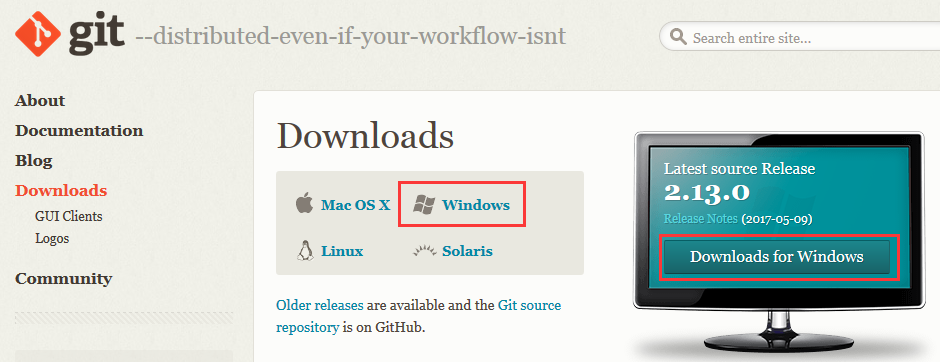
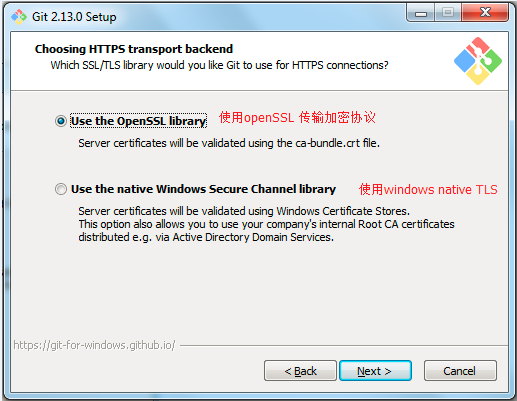
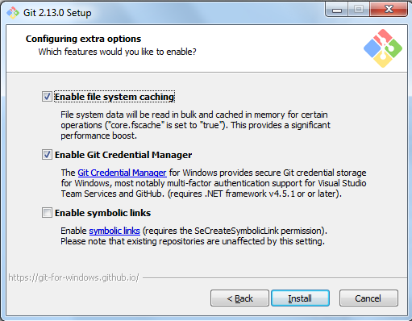
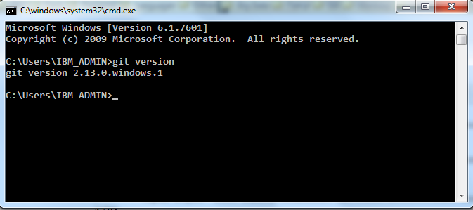

# Git环境安装

[TOC]

---

## 一、Git下载
如果想安装较新版本的 Git ，则需要⾃⾏下载 Git 源码来编译安装。

链接|详细地址
---|---
[Git官网下载链接](http://www.git-scm.com/download/)|http://www.git-scm.com/download/
[Git镜像下载链接](https://mirrors.edge.kernel.org/pub/software/scm/git/)|https://mirrors.edge.kernel.org/pub/software/scm/git/
[Git下载链接（Github地址）](https://github.com/git/git/releases)|https://github.com/git/git/releases
[Window版本Git下载链接（GitHub地址）](https://github.com/git-for-windows/git/releases/)|https://github.com/git-for-windows/git/releases/
[Window版本Git下载链接（淘宝镜像地址）](https://npm.taobao.org/mirrors/git-for-windows/)|https://npm.taobao.org/mirrors/git-for-windows/
[Github官网文档](https://docs.github.com/cn)|https://docs.github.com/cn


---
---
---
## 二、Windows操作系统环境下安装Git
### 1. 准备Git安装包


### 2. 安装Git
#### 2.1 双击安装程序，进入欢迎界面点击【Next >】


#### 2.2 阅读协议，点击【Next >】


#### 2.3 选择安装位置，点击【Next >】


#### 2.4 选择安装组件：这里可以使用默认选项，点击【Next >】
* 图标组件（Additional icons）：选择是否创建桌面快捷方式
* 桌面浏览（Windows Explorer integration） 
>* 使用Git Bash方式，shell方式
>* 受用桌面程序方式
* 关联配置文件：是否关联git配置文件，该配置文件主要显示文本编辑器样式
* 关联shell脚本文件：是否关联Bash命令执行脚本文件
* 使用TrueType编码：在命令行中是否使用TrueType编码，该编码是微软和苹果公司制定的通用编码


#### 2.5 是否创建开始菜单快捷方式目录，点击【Next >】


#### 2.6 设置环境，选择使用什么样儿的命令行工具，一般情况我们使用默认配置，使用Git Bash，点击【Next >】
* Git自带：使用Git自带的Git Bash命令行工具
* 系统自带CMD：使用windows系统的命令行工具
* 二者都有：上面二者同时配置，但是注意，这样会将windows中的find.exe和sort.exe工具覆盖，如果不懂这些尽量不要选择


#### 2.7 设置HTTPS 传输加密方式，点击【Next >】
* 使用OpenSSL库
* 使用本机Windows安全通道库

  
#### 2.8 选择换行格式，点击【Next >】 
* 让Git能够自动转换文件中的换行符：签出到本地时转换为Windows下的换行符，提交到服务器时转换为Unix下的换行符
* 让Git在签出到本地时不做转换，保留原始文件的换行符；提交到服务器时转换为Unix下的换行符
* 让Git在签出到本地时和提交到服务器时都不做转换


#### 2.9 配置Git bash终端仿真器，点击【Next >】
* 使用MinTTY终端
* 使用windows默认的命令行 


#### 2.10 性能配置，是否启用文件系统缓存，点击【Next >】


#### 2.11 开始安装


#### 2.12 安装完成，点击【Finish】


### 3. 环境变量配置(使用CMD执行Git命令的需要配置此选项)
> 安装成功后需要配置Git环境变量「注意该步骤为`Git`在`windows cmd`中使用Git命令，需要执行下面的操作配置，如果`不配置`，直接使用`Git Bash`也可以」

右击计算机（我的电脑） >> 选择属性 >>  选择高级系统设置 >>  选择高级 >> 选择环境变量 >> Path变量；

在高级参数Path变量中指定Git的安装目录
```shell script
C:\Program Files\Git\cmd
```


验证是否配置成功，打开`windows cmd命令行` 输入，`git version`命令，出现下列信息表示配置成功。



---
---
---
## 三、Linux操作系统环境下安装Git
### ⽅式⼀：通过包管理器安装
在 Linux 上安装 Git 向来仅需⼀⾏命令即可搞定，因为各式各样的包管理器帮了我们⼤忙，所以对于
CentOS 系统来讲，直接执⾏如下命令即可安装：
```shell script
yum install git
```
当然通过这种⽅式安装的 `Git `可能不是`较新版的 Git` ，以我们的实验环境 `CentOS 7.4` 来说，这种⽅式安装的 Git 版本为` 1.8.3.1` ，不过⼀般来说是够⽤的。

### ⽅法⼆：通过源码编译安装

#### 1. 准备Git安装包
本教程以2.26.2版本进行演示：  v2.26.2.tar.gz ，我们将tar.gz包放到服务器的/usr/local/目录下（位置自己定）。

然后将其本地解压，得到 git-2.26.2 ⽬录：
```shell script
tar -zxvf v2.26.2.tar.gz
```

#### 2. 提前安装可能所需的依赖
```shell script
yum install curl-devel expat-devel gettext-devel openssl-devel zlibdevel gcc-c++ perl-ExtUtils-MakeMaker


或者

yum -y install gcc curl curl-devel zlib-devel perl-ExtUtils-CBuilder perl-ExtUtils-MakeMaker
yum -y install openssl openssl-devel expat-devel
```

#### 3. 编译安装Git
进⼊到对应⽬录，执⾏配置、编译、安装命令即可，如下所示：

* 编译git源码，进入cd /usr/local/git-2.26.2 目录
```shell script
[root@localhost ~]# cd git-2.26.2/
```

* 编译git源码
```shell script
方式一：
[root@localhost git-2.26.2]# make prefix=/usr/local/git all

方式二：
[root@localhost git-2.26.2]# make configure
[root@localhost git-2.26.2]# ./configure --prefix=/usr/local/git
```

* 安装git至/usr/bin/git路径
```shell script
方式一：
[root@localhost git-2.26.2]# make prefix=/usr/local/git install

方式二：
[root@localhost git-2.26.2]# make profix=/usr/local/git
[root@localhost git-2.26.2]# make install
```


#### 4. 将Git加⼊环境变量
将 Git 的可执⾏程序加⼊环境变量，便于后续使⽤
编辑配置⽂件：
```shell script
vim /etc/profile
```
尾部加⼊ Git 的 bin 路径配置即可
```shell script
export GIT_HOME=/usr/local/git
export PATH=$PATH:$GIT_HOME/bin
```
最后执⾏ source /etc/profile 使环境变量⽣效即可。

#### 5. 查看安装结果
执⾏ git --version 查看安装后的版本即可


---
---
---
## 四、使用SSH免密登录GitHub
>* 创建SSH Keys并将公钥加到GitHub账户中，使用SSH Keys在本机和GitHub之间建立一个安全的连接。
>* 使用git bash之前需要配置ssh密钥，ssh是一种网络协议，用于计算机之间的加密登陆。，所以要想在github上提交代码，就要先添加ssh key 配置。
>* 使用SSH密钥登陆，在Push时不用频繁的输入用户名和密码。


### 1. Windows系统环境下生成SSH key并连接GitHub
#### 1.1 检查SSH密钥(keys)是否存在
输入如下命令：
```shell script
cd ~/.ssh
ll
```
如果，不存在此目录，则进行第二步操作；否则，你本机已经存在ssh公钥和私钥，可以略过第二步，直接进入第三步操作。


#### 1.2 生成SSH
输入如下命令生成SSH
```shell script
ssh
```


#### 1.3 配置全局用户名和Email地址
git config命令的`-–global`参数，表示你这台机器上所有的Git仓库都会使用这个配置，
也可以对某个仓库指定不同的用户名和Email地址（一般情况下都是一个）。

本文教程以`全局配置为`主，命令如下：
```shell script
git config --global user.name "your_name"
git config --global user.password "your_password" //注：该配置不设置也可以，自行选择
git config --global user.email "your_email@example.com"
```

> 扩展
##### 1.3.1 查看git配置信息
```shell script
git config -l
或者
git config --list
```

##### 1.3.2 查看git用户名、密码、邮箱的配置
```shell script
git config user.name
git config user.password
git config user.email
```

##### 1.3.3 设置git用户名、密码、邮箱的配置
```shell script
git config user.name "your_name"
git config user.password "your_password"
git config user.email "your_email@example.com"
```

##### 1.3.4 修改git用户名、密码、邮箱的配置
```shell script
git config user.name
git config user.password
git config user.email
```

##### 1.3.5 修改git用户名、密码、邮箱的配置（全局配置）
```shell script
git config --global user.name "your_name"
git config --global user.password "your_password" 
git config --global user.email "your_email@example.com"
```

#### 1.4 使用Rsa算法生成SSH密钥(keys)
按照你提供的邮箱地址，创建SSH密钥；输入如下命令：
```shell script
ssh-keygen -t rsa -C "your_email@example.com"
```
将SSH密码粘贴到剪切板中
```shell script
clip<~/.ssh/id_rsa.pub
```


下面是对图中语句的解释（看懂英文的可以直接跳过下面内容）：

* 由于演示的时候这个ssh文件已经存在，所以会出现下面这个语句；`想重新生成SSH的，直接覆盖即可`！！
```shell script
Overwrite (y/n)?
```

* 这个的意思就是让你输入该账户（你上面输入的邮箱）的密码，`直接回车跳过也可以`。
```shell script
Enter passphrase(empty forno passphrase):[Typeapassphrase]
Enter same passphrase again:[Type passphrase again]
```

* 密钥生成的位置`/c/Users/Admin/`
```shell script
Your identification has been saved in /c/Users/Admin/.ssh/id_rsa.
Your public key has been saved in /c/Users/Admin/.ssh/id_rsa.pub.
```

* 密钥的关键内容是
```shell script
SHA256:N20m0PnwfNSZZaCOvp8gW8Fac49kIQo1fUMz+490AO8 your_email@example.com
```

#### 1.5 GitHub添加SSH密钥(keys)
刚才在本地使用Git Bash生成一个SSH密钥，现在这步的操作就是与Github通过SSH连接。

打开GitHub并登陆自己的账号，进入到首页
选择【Account Settings】 >> Setting >> SSH and GPGkeys >> Add SSh key

`Title`是`密钥的名字`，随便起就行，前提是不要与其他的密钥名字相重复，然后将`密钥（id_rsa.pub）`粘贴到`key`中


#### 1.6 测试SSH连接是否成功
在Git Bash中输入如下代码，显示密钥为绿色为添加成功。
```shell script
ssh -T  git@github.com 
```


#### 1.6 可能出现的问题
出现下面这中情况：说明密钥文件出错，查看复制粘贴是否为`id_rsa.pub`文件？确定不是`git_rsa.pub`文件。


---
### 2. Mac系统环境下生成SSH key并连接GitHub
Mac系统环境下生成SSH Key连接Github与Windows系统环境操作基本一致！！

注：如果前面没有将生成的密钥存放在默认的文件id_rsa中（而是my_rsa中）,那么ssh -T git@github.com命令就需要添加参数来执行。

输入如下命令：
```shell script
ssh -T -i my_rsa git@github.com
```


---
---
---
## 五、单机环境如何控制不同的SSH Keys连不同的Git环境（步骤待验证）
其实，一套SSH密钥是可以用在`不同的SSH环境`的。但是如果由于某种要求，需要用不同的SSH密钥连接不同的Git环境。假设具体场景是，已经建了`密钥github_rsa`，
还需要创建work_rsa连接工作环境git仓库。

操作如下：
### 1. 创建另一对密钥work_rsa，保存密钥为work_rsa
```shell script
ssh-keygen -t rsa -C "work@mail.com"
```

### 12. 添加新身份信息
```shell script
ssh-add ～/.ssh/work_rsa
```

### 13. 配置.ssh/config
我们需要通过Host别名，将不同的账号区分开来。
```shell script
Host me.github.com
HostName github.com
PreferredAuthentications publickey
IdentityFile~/.ssh/github_rsa
Host work.comp.com
HostName comp.com
PreferredAuthentications publickey
IdentityFile~/.ssh/work_rsa
```