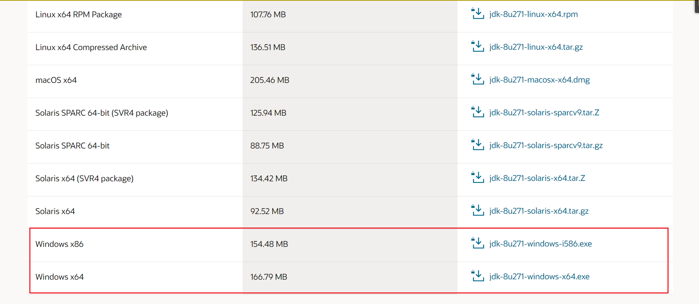
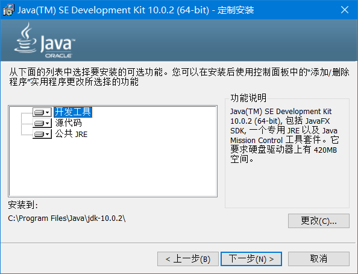
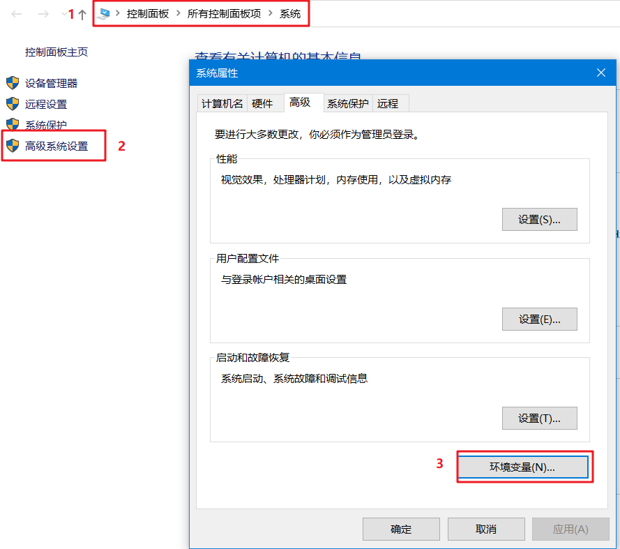
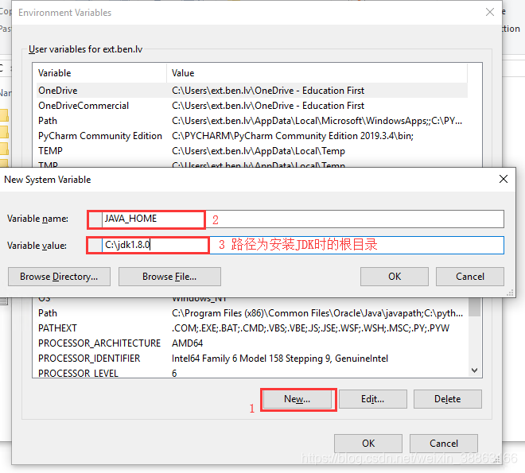
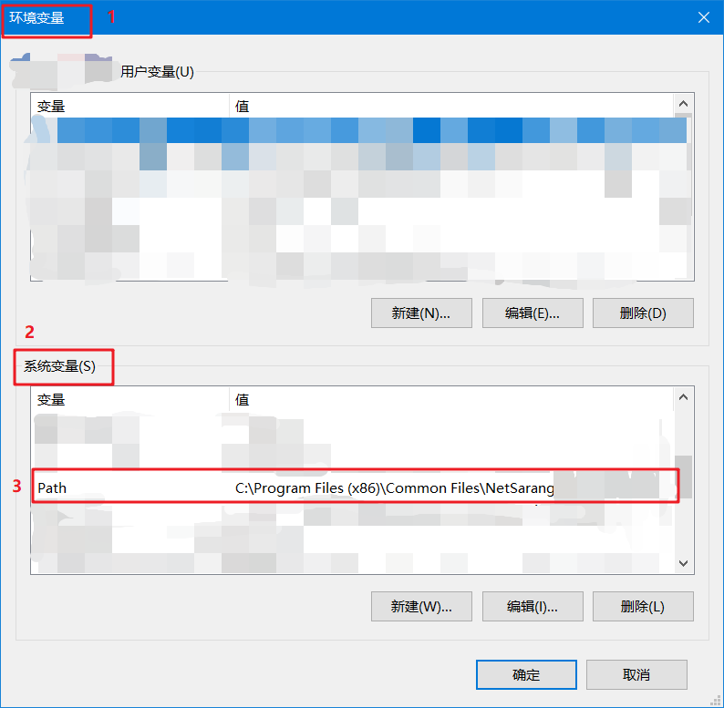
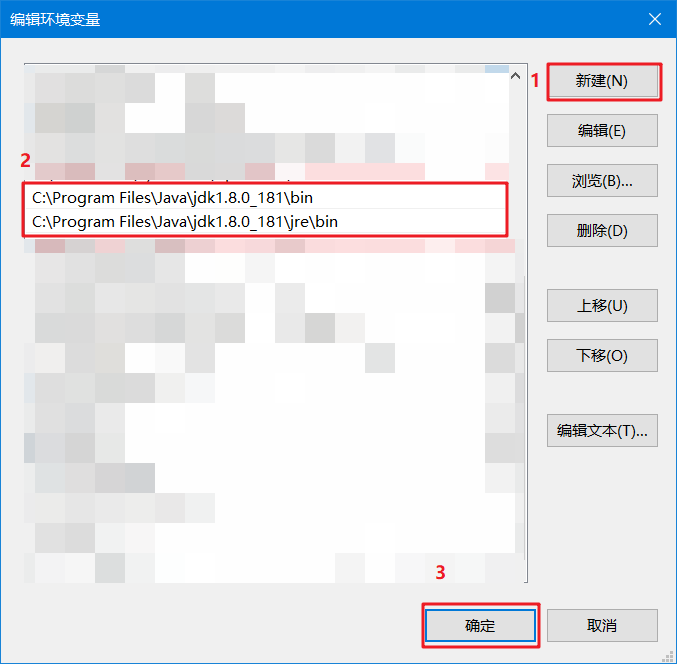
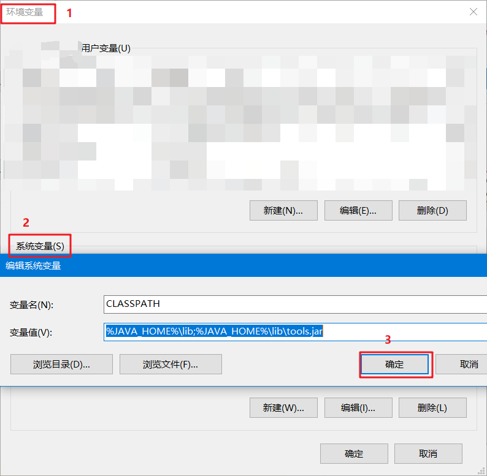
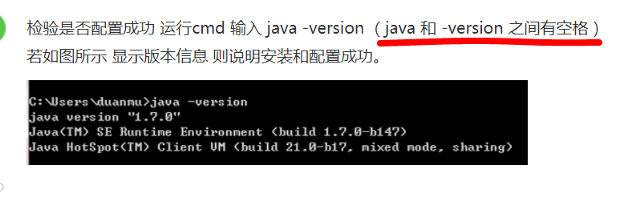
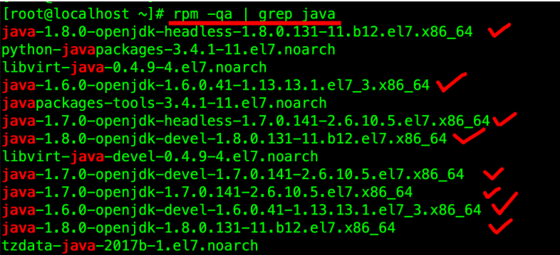
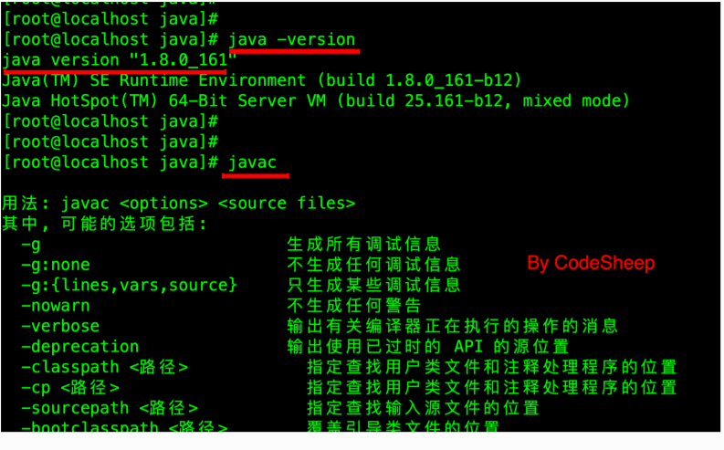

# JDK环境安装

[TOC]

---
## 一、准备JDK安装包
### 下载地址
文件名|地址链接|详细链接
:---|:----:|----
JDK国内镜像下载|[链接](https://mirrors.tuna.tsinghua.edu.cn/AdoptOpenJDK/)|https://mirrors.tuna.tsinghua.edu.cn/AdoptOpenJDK/
JDK官方地址下载| [链接](https://www.oracle.com/java/technologies/javase-downloads.html)|https://www.oracle.com/java/technologies/javase-downloads.html
开发者搜索引擎|[链接](https://kaifa.baidu.com/home)|https://kaifa.baidu.com/home

---
# 接下来这里以JDK 8版本安装部署

## 二、Windows操作系统安装JDK
下载文件

选择自己电脑配置的版本，将下载好的jdk-8u181-windows-x64.exe文件双击进行安装(由于本机已经安装，所以这里显示的是JDK10版本，部分图片实在网络上收集的)

这里面的JDK路径最好不要改，实在要是改自己记住也没有问题，这个后面会使用！！！

* 请根据自己的实际路径进行配置
> JDK 位置：C:\Program Files\Java\jdk1.8.0_181
### 1. 配置环境变量
右击计算机（我的电脑） >> 选择属性 >>  选择高级系统设置 >>  选择高级 >> 选择环境变量；


### 2. 配置JAVA_HOME变量
选择系统变量 >> 添加变量 >> JAVA_HOME
```
变量名：JAVA_HOME 
变量值：C:\Program Files\Java\jdk1.8.0_181
```


### 3. 配置Path变量
选择系统变量 >> 添加Path变量：在系统变量内找到PAT >> 点击【编辑】 >> 【新建】；
```
变量值：%JAVA_HOME%\bin;
变量值：%JAVA_HOME%\jre\bin;
``` 



### 3. 配置CLASSPATH变量
选择系统变量 >> 添加变量 >> CLASSPATH
```
变量名：CLASSPATH
变量值：%JAVA_HOME%\lib;%JAVA_HOME%\lib\tools.jar
```


### 4. 测试JDK是否安装成功
打开CMD进行环境验证
>* "快捷点(win+R)"->"运行"，键入"cmd"；
>* 键入命令: java -version、java、javac 几个命令，出现以下信息，说明环境变量配置成功；



---
---
---

## 三、Linux操作系统安装JDK
我这⾥下载的是 jdk-8u271-linux-x64.tar.gz 安装包，并将其直接放在了 /usr/local/ ⽬录下
### 1. 卸载已有的OPENJDK（如果有）
如果系统⾃带有 OpenJDK ，可以按照如下步骤提前卸载之。
⾸先查找已经安装的 OpenJDK 包：
```
rpm -qa | grep java
```

接下来可以将 java 开头的安装包均卸载即可：
```
yum -y remove java-1.7.0-openjdk-1.7.0.141-2.6.10.5.el7.x86_64
yum -y remove java-1.8.0-openjdk-1.8.0.131-11.b12.el7.x86_64

... 省略 ...
```
### 2. 创建⽬录并解压
#### 2.1 在 /usr/local/ 下创建 java ⽂件夹并进⼊
```
cd /usr/local/
mkdir java
cd java
```
#### 2.2 将上⾯准备好的 JDK 安装包解压到 /usr/local/java 中即可
```
tar -zxvf /usr/local/jdk-8u161-linux-x64.tar.gz -C ./
```
解压完之后， /usr/local/java ⽬录中会出现⼀个 jdk1.8.0_161 的⽬录
### 3. 配置JDK环境变量
编辑 /etc/profile ⽂件，在⽂件尾部加⼊如下 JDK 环境配置即可
```
JAVA_HOME=/usr/local/java/jdk1.8.0_161
CLASSPATH=$JAVA_HOME/lib/
PATH=$PATH:$JAVA_HOME/bin
export PATH JAVA_HOME CLASSPATH
```
然后执⾏如下命令让环境变量⽣效
```
source /etc/profile
```
### 4. 验证JDK安装结果
输⼊如下命令即可检查安装结果：
```
java -version

javac
```
