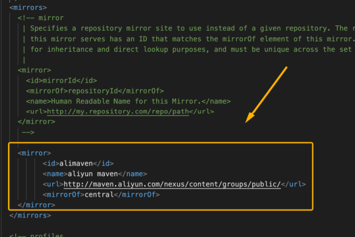
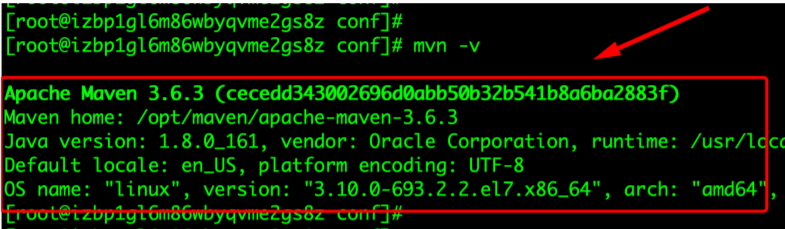

# Web服务器Maven安装部署

[TOC]

---
---
---
## 一、Maven下载

文件名|地址链接|详细地址
:---|:---:|:---
Maven镜像下载链接|[链接](https://mirrors.tuna.tsinghua.edu.cn/apache/maven/maven-3/)|https://mirrors.tuna.tsinghua.edu.cn/apache/maven/maven-3/
Maven官方下载链接|[链接](https://maven.apache.org/download.cgi)|https://maven.apache.org/download.cgi
Maven官方仓库|[链接](https://mvnrepository.com/)|https://mvnrepository.com/
Maven镜像仓库|[链接](https://repo.maven.apache.org/maven2/)|https://repo.maven.apache.org/maven2/

---
---
## 二、Linux操作系统环境下安装Maven
### 1. 准备安装包
本教程以 Maven 3.3.9版本进行演示： apache-maven-3.3.9-bin.tar.gz，我们将tar.gz包放到服务器的/usr/local/目录下（位置自己定）。

### 2. 解压并安装
在 /usr/local/ 下创建 maven ⽂件夹并进⼊
```shell script
cd /usr/local/
mkdir maven
cd maven
```
将 Maven 安装包解压到 /usr/local/maven 这个文件夹下
```shell script
 tar -zxvf /usr/local/apache-maven-3.3.9-bin.tar.gz -C ./
```
解压完成后， ⽬录/usr/local/maven/中会出现⼀个apache-maven-3.3.9 的⽬录


### 3. 配置MAVEN加速镜像源
这⾥配置的是阿⾥云的maven镜像源。有条件的可以跳过！！！

* 编辑修改 /usr/local/maven/apache-maven-3.3.9/conf/settings.xml⽂件
```shell script
vim /usr/local/maven/apache-maven-3.3.9/conf/settings.xml
```
* 在节点<mirrors></mirrors> 标签对⾥添加如下内容即可：
```xml
<mirror>
     <id>alimaven</id>
     <name>aliyun maven</name>
     <url>http://maven.aliyun.com/nexus/content/groups/public/</url>
     <mirrorOf>central</mirrorOf>
</mirror>
```


### 4. 配置Maven环境变量
因为下载的是⼆进制版安装包，所以解压完，配置好环境变量即可使⽤了。

* 编辑修改 /etc/profile ⽂件
```shell script
vim  /etc/profile
```

* 在⽂件尾部添加如下内容，配置 maven 的安装路径
```
export MAVEN_HOME=/usr/local/maven/apache-maven-3.3.9
export PATH=$MAVEN_HOME/bin:$PATH
```

* 接下来执⾏ source /etc/profile 来刷新环境变量，让 maven 环境的路径配置⽣效。
```shell script
source /etc/profile
```


### 5. 验证Maven环境
执⾏ mvn –v ，能打印出 maven 版本信息说明安装、配置成功
```shell script
 mvn –v
```

