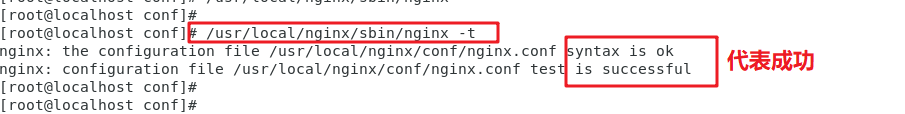
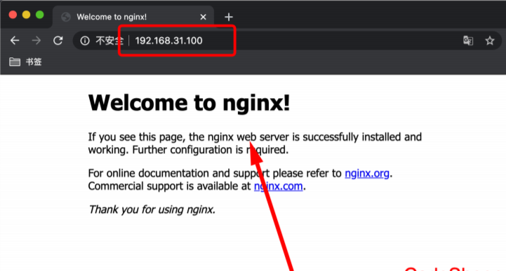
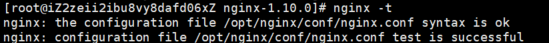
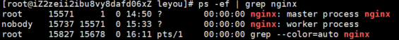
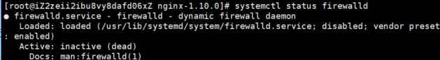
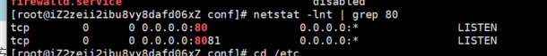

# Web服务器Nginx安装部署

[TOC]

---
---
---
## 一、Nginx下载

文件名|地址链接|详细地址
:---|:---:|:---
Nginx官方下载链接|[链接](http://nginx.org/en/download.html)|http://nginx.org/en/download.html
源代码仓库_Code|[链接](http://hg.nginx.org/nginx)|http://hg.nginx.org/nginx
源代码仓库_Site|[链接](http://hg.nginx.org/nginx.org)|http://hg.nginx.org/nginx.org
Linux安装Nginx|[链接](http://nginx.org/en/linux_packages.html)|http://nginx.org/en/linux_packages.html

---
---
---
## 二、Linux操作系统环境下安装Nginx
### 1. 准备安装包
本教程以nginx-1.19.5版本进行演示： nginx-1.19.5.tar.gz，我们将tar.gz包放到服务器的/usr/local/目录下（位置自己定）。

### 2. 解压并安装
* 在/usr/local/ 下创建 nginx ⽂件夹并进⼊
```shell script
cd /usr/local/
mkdir nginx
cd nginx

或者

mkdir -p /usr/local/nginx
cd /usr/local/nginx/
```

* 将 Nginx 安装包解压到 /usr/local/nginx 中即可
```shell script
tar zxvf /usr/local/nginx-1.19.5.tar.gz -C ./

或者

tar -zxvf nginx-1.19.5.tar.gz -C /usr/local/nginx/
```
解压完之后， /usr/local/nginx ⽬录中会出现⼀个 nginx-1.19.5 的⽬录

### 3. 预先安装额外的依赖
在Linux下安装Nginx还需要安装4个库，分别是gcc、PCRE、zlib、openssl
```shell script
yum -y install pcre-devel
yum -y install openssl openssl-devel

或者

yum install -y gcc-c++ pcre pcre-devel zlib zlib-devel openssl openssl-devel
```

### 4. 编译安装Nginx
* 进入到刚才解压好的nginx-1.19.5目录
```shell script
cd nginx-1.17.10
```
* 开始编译
```shell script
./configure --prefix=/usr/local/nginx \
make & make install

或者执行命令

./configure
make && make install
```

安装完成后，Nginx的可执⾏⽂件位置位于
```shell script
/usr/local/nginx/sbin/nginx
```

### 5. 启动Nginx方式一
#### 5.1 启动Nginx服务
```shell script
 /usr/local/nginx/sbin/nginx
```
#### 5.2 快速停⽌Nginx服务
> 快速停止，此方式相当于先查出nginx进程id再使用kill命令强制杀掉进程。
```shell script
/usr/local/nginx/sbin/nginx -s stop
```

#### 5.3 完整停⽌Nginx服务
> 完整停止（建议使用）,此方式停止步骤是待nginx进程处理任务完毕进行停止。
```shell script
/usr/local/nginx/sbin/nginx -s quit
```

#### 5.4 修改配置⽂件后重新加载Nginx服务
```shell script
/usr/local/nginx/sbin/nginx -s reload
```

#### 5.5 重启Nginx服务
```shell script
/usr/local/nginx/sbin/nginx -s quit
/usr/local/nginx/sbin/nginx
```

#### 5.6 检查Nginx配置是否成功
```shell script
/usr/local/nginx/sbin/nginx -t 
```



#### 5.7 Nginx配置文件位置
```shell script
/usr/local/nginx/conf/nginx.conf
```

#### 5.8 浏览器验证启动情况



### 6. 启动Nginx方式二
#### 6.1 进入安装Nginx文件夹
```shell script
cd /usr/local/nginx/sbin/
```

#### 6.2 启动nginx
```shell script
./sbin/nginx
```

#### 6.3 快速停止nginx
```shell script
./sbin/nginx -s stop
```

#### 6.4 完整停止nginx
```shell script
./sbin/nginx -s quit
```

#### 6.5 重启nginx
```shell script
./nginx -s quit
./nginx
```

---
---
---
##  三、Nginx启动成功无法访问网页
以下为Nginx启动成功无法访问网页的结局方案，可一一由上至下一一排除！！！

### 1. 检查配置是否成功
```shell script
/usr/local/nginx/sbin/nginx -t 
```


### 2. Nginx进程是否存在
```shell script
ps -ef | grep nginx
```


### 3. Linux防火墙是否关闭
#### 3.1 linux 6.5操作系统
* 查看防火墙状态
```shell script
service iptables status
```

* 暂时关闭防火墙
 ```shell script
 service iptables stop
 ```

#### 3.2 linux 7.0操作系统
linux 7.0以上默认安装firewalld
* 查看防火墙状态
```shell script
systemctl status firewalld 

或者 

firewall-cmd --state
```
下图为关闭状态


* 停止并禁用开机启动
```shell script
systemctl disable firewalld
```
* 禁用防火墙
```shell script
systemctl stop firewalld
```

* 启动防火墙
```shell script
systemctl start firewalld
```

* 设置开机启动
```shell script
systemctl enable firewalld
```

* 重启防火墙
```shell script
firewall-cmd --reload
```

### 4. 端口是否开放
Nginx配置的端口是哪个就检查哪个端口号，这里以`80`端口为主！！！
```shell script
netstat -lnt | grep 80
```



