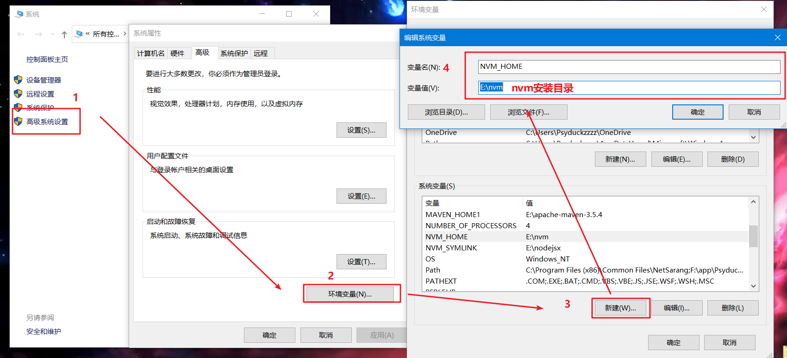
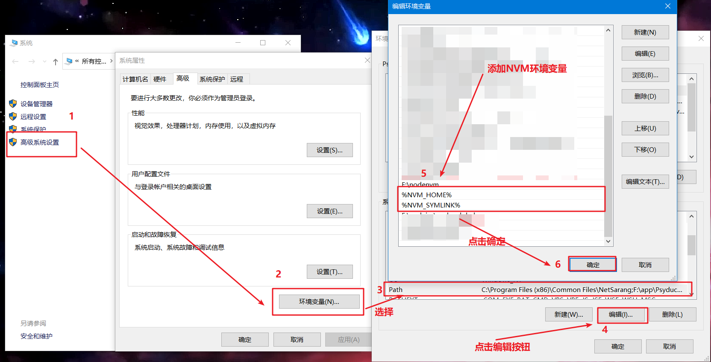
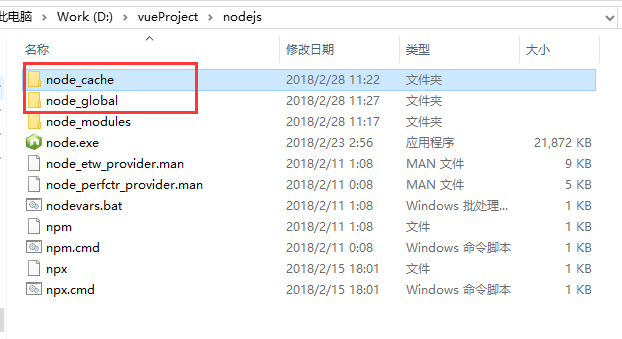
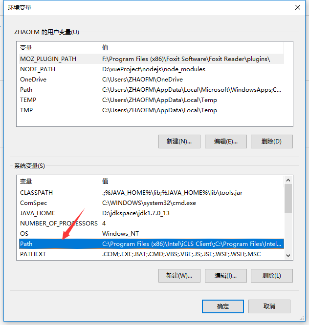
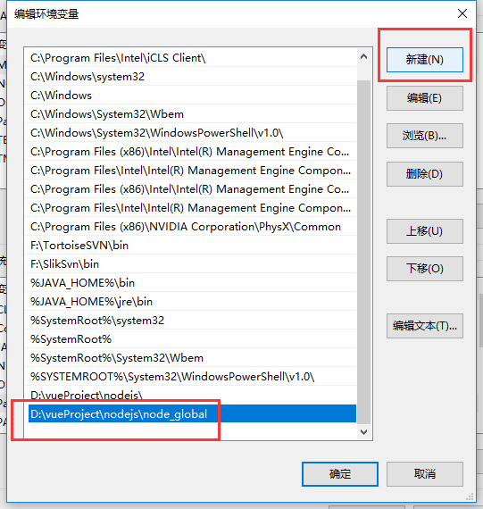
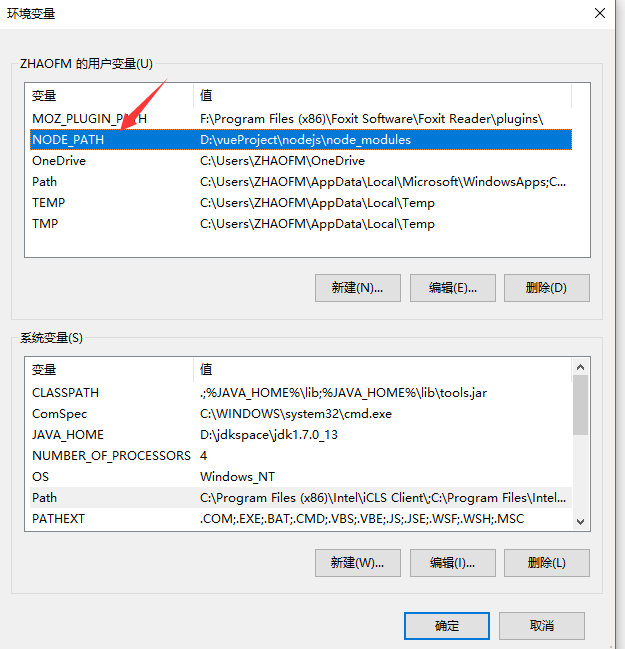
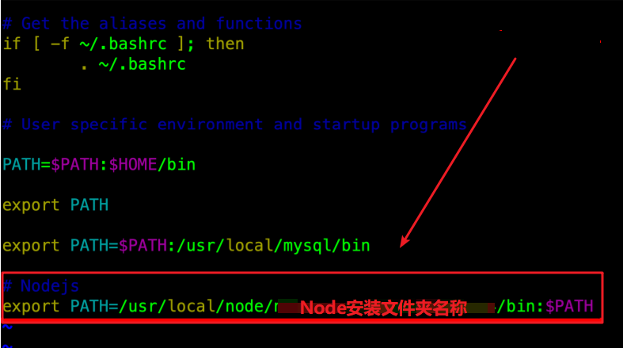

# 部署Node环境

[TOC]

---
---
---

## 一、Node下载
文件名|地址链接|详细地址
:----|:-----:|:-----
官方地址链接|[链接](https://nodejs.org/zh-cn/)|https://nodejs.org/zh-cn/
Node历史版本官方链接|[链接](https://nodejs.org/download/release/)|https://nodejs.org/download/release/
Node历史版本官方链接|[链接](https://nodejs.org/zh-cn/download/releases/)|https://nodejs.org/zh-cn/download/releases/
阿里云镜像链接|[链接](https://npm.taobao.org/mirrors/node/)|https://npm.taobao.org/mirrors/node/
Docker镜像链接|[链接](https://hub.docker.com/_/node/)|https://hub.docker.com/_/node/
Github源码链接|[链接](https://github.com/nodejs/node)|https://github.com/nodejs/node
Node API中文文档|[链接](http://nodejs.cn/api/)|http://nodejs.cn/api/

---
---
---
## 二、Windows操作系统环境下安装Node
### 1. 安装Node版本控制工具nvm（可略过）
```shell script
Node Version Manager - POSIX-compliant bash script to manage multiple active node.js versions
```
上面的意思可以理解为：当不同项目使用不同的Node版本时，在同一台设备需要在多个Node版本之间进行切换，非常的麻烦。nvm工具就是一个管理Node版本的工具，方便管理！！！

* 下载地址如下：

文件名|链接|详细地址
:----|:---:|:-----
nvm下载链接|[链接](https://github.com/coreybutler/nvm-windows/releases)|https://github.com/coreybutler/nvm-windows/releases
nvm官方说明|[链接](https://github.com/nvm-sh/nvm)|https://github.com/nvm-sh/nvm

文件名|说明
:----|:---
nvm-noinstall.zip| 免安装版本，使用之前需要配置环境变量
nvm-setup.zip|安装包，下载之后点击安装，不需要配置就可以使用，非常的方便
Source code(zip)|zip压缩的源码
Sourc code(tar.gz)|tar.gz的源码，一般用于 linux 系统

这里是以Windos环境为主，所以下载nvm-setup.zip


* 下载nvm-setup.zip

点击安装，安装路径自行选择即可(这里略过)！！

* 配置nvm环境变量
> 点击高级系统配 >> 环境变量 >> 点击【新建】,这里的变量值是安装NVM时自己选择的安装目录。
```
变量名 = NVM_HOME

变量值 = E://nvm
```


> 设置Path变量
```
%NVM_HOME%

%NVM_SYMLINK%
```


* 验证nvm环境
打开cmd，然后输入nvm -v

* 常用nvm语法
>nvm list：查看目前已经安装的版本
>
>nvm uninstall [version]：卸载指定版本的node。
>
>nvm node_mirror [url]：设置nvm的镜像。
>
>nvm npm_mirror [url]：设置npm的镜像。
>
>nvm list available //显示可下载版本的部分列表
>
>nvm install 10.15.0 //安装指定的版本的nodejs
>
>nvm use 10.15.0 //使用指定版本的nodejs
>
>npm install -g cnpm --registry=https://registry.npm.taobao.org //使用淘宝镜像

```shell script
nvm arch [32|64] ： 显示node是运行在32位还是64位模式。指定32或64来覆盖默认体系结构。
nvm install <version> [arch]： 该可以是node.js版本或最新稳定版本latest。（可选[arch]）指定安装32位或64位版本（默认为系统arch）。设置[arch]为all以安装32和64位版本。在命令后面添加--insecure ，可以绕过远端下载服务器的SSL验证。
nvm list [available]： 列出已经安装的node.js版本。可选的available，显示可下载版本的部分列表。这个命令可以简写为nvm ls [available]。
nvm on： 启用node.js版本管理。
nvm off： 禁用node.js版本管理(不卸载任何东西)
nvm proxy [url]： 设置用于下载的代理。留[url]空白，以查看当前的代理。设置[url]为none删除代理。
nvm node_mirror [url]：设置node镜像，默认为https://nodejs.org/dist/.。我建议设置为淘宝的镜像https://npm.taobao.org/mirrors/node/
nvm npm_mirror [url]：设置npm镜像，默认为https://github.com/npm/npm/archive/。我建议设置为淘宝的镜像https://npm.taobao.org/mirrors/npm/
nvm uninstall <version>： 卸载指定版本的nodejs。
nvm use [version] [arch]： 切换到使用指定的nodejs版本。可以指定32/64位[arch]。nvm use <arch>将继续使用所选版本，但根据提供的值切换到32/64位模式的<arch>
nvm root [path]： 设置 nvm 存储node.js不同版本的目录 ,如果未设置，将使用当前目录。
nvm version： 显示当前运行的nvm版本，可以简写为nvm v
nvm install node：安装最新版的node.js。nvm i == nvm install
```

### 2. 安装Node
如何你使用nvm对node进行版本控制，可以使用命令安装Node，安装node由两种方式，如下：
#### 2.1 方式一、通过nvm安装
* 执行安装命令
```shell script
# 需要知道node的版本号
# nvm install <version> [<arch>]命令下载版本 ,arch代表操作系统的位数 64或32 ，默认值为64
nvm install x.x.x

# 如果使用上面的语句下载Node慢的话，可以更改镜像，命令如下： 
nvm node_mirror https://npm.taobao.org/mirrors/node/
nvm npm_mirror https://npm.taobao.org/mirrors/npm/
```

* 配置环境变量
局使用nvm命令，需要配置环境变量，操作如下：点击我的电脑 >> 属性 >> 高级设置 >> 环境变量 >> 环境变量配置

> a. 找到系统变量
```shell script
删除系统自带的nvm变量：NVM_HOME和NVM_SYMLINK
```

> b. 打开path：删除nvm自动添加的变量
```shell script
Path = %NVM_HOME%;%NVM_SYMLINK%
```

> c. 配置用户变量
```shell script
NVM_HOME = C:\Users\zhong\AppData\Roaming\nvm          
NVM_SYMLINK = C:\Program Files\nodejs 
Path = %NVM_HOME%;%NVM_SYMLINK%
```


* 测试NODE、NPM或者CNPM是否安装成功
```shell script
node -v
npm -v
```

* 命令集合
```shell script
# 卸载包
npm uninstall [package]

# 更新包
npm update [package]

# 搜索包
npm search [package]

# 使用淘宝镜像(cnpm)
npm install -g cnpm --registry=https://registry.npm.taobao.org 
```
#### 2.2 方式二、下载node版本手动安装
* 下载windows的node安装包，一路默认安装即可（安装路径自行选择）！！！！

* 设置nodejsPrefix（全局）和cache（缓存）路径

这两个文件夹（node_cache、node_global）最好【新建】在安装node的目录下，名字随便起。


设置缓存文件夹（可使用CMD命令，`不想设置的跳过即可`）
```shell script
# 设置缓存
npm config set cache "E:\nodejsx\node_cache"
```

```shell script
# 设置全局模块存放路径
npm config set prefix "E:\nodejsx\node_global"
```
使用npm设置cache和prefix后，这个配置保存在路径`C:\Users\Administrator`，文件名叫`.npmrc`

* 配置淘宝镜像

下载好node之后，打开docs管理工具，先看看node安装成功了没有，输入 ·`node -v `，回车，会输出node的版本号，这样就已经是安装成功了。
由于在国内使用npm是非常慢的，所以在这里我们推荐使用`淘宝npm镜像`，使用淘宝的cnpm命令管理工具可以代替默认的npm管理工具
```shell script
npm install -g cnpm --registry=https://registry.npm.taobao.org

npm install -g cnpm --registry=https://registry.npm.taobao.org
```

* 配置环境变量（非常重要）

设置环境变量可以使得住任意目录下都可以使用cnpm、vue等命令，而不需要输入全路径
> 配置path变量

点击我的电脑 >> 属性 >> 高级设置 >> 环境变量 >> 环境变量配置



> 新增系统变量NODE_PATH 



* 验证
在CMD命令中输入
```shell script
npm -v
node -v
```

---
---
---
## 二、Linux操作系统环境下安装Node

### 1. 准备安装包
本教程以node-v8.11.4版本进行演示： node-v8.11.4-linux-x86.tar.xz，我们将tar.gz包放到服务器的/usr/local/目录下（位置自己定）。

### 2. 创建⽬录并解压
* 在 /usr/local/ 下创建 node ⽂件夹并进⼊
```shell script
cd /usr/local/
mkdir node
cd node
```
* Node 的安装包解压到 /usr/local/node 中即可
```shell script
 tar -xJvf /root/node-v8.11.4-linux-x64.tar.xz -C ./
```
解压完之后， /usr/local/node ⽬录中会出现⼀个 node-v8.11.4-linux-x64 的⽬录

### 3. 配置NODE系统环境变量
* 编辑 ~/.bash_profile ⽂件
```shell script
vim  ~/.bash_profile
```

* 在⽂件末尾追加如下信息
```shell script
# Nodejs
export PATH=/usr/local/node/node-v8.11.4-linux-x64/bin:$PATH
```


* 刷新全局环境变量
```shell script
source ~/.bash_profile
```

### 4. 测试Node环境
```shell script
node -v
npm version
npx -v
```
使用如上命令后，控制台会打印关于node的版本信息，及npm版本信息


