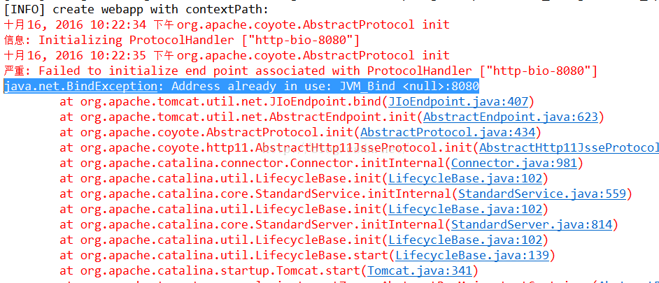

# Tomcat环境安装

[TOC]

---

## 一、Tomcat下载
链接|详细地址
---|---
[Tomcat官网下载链接](https://tomcat.apache.org/download-80.cgi)|https://tomcat.apache.org/download-80.cgi


## 二、Linux操作系统环境下安装Tomcat
### 1. 准备安装包
本教程以Tomcat 8.5.61版本进行演示： apache-tomcat-8.5.61.tar.gz，我们将tar.gz包放到服务器的/usr/local/目录下（位置自己定）。

### 2. 解压并安装
* 在 /usr/local/ 下创建 tomcat ⽂件夹并进⼊
```shell script
cd /usr/local/
mkdir tomcat
cd tomcat
```

* 将 Tomcat 安装包解压到 /usr/local/tomcat 这个文件夹下
```shell script
 tar -zxvf /usr/local/apache-tomcat-8.5.61.tar.gz -C ./
```
解压完成后， ⽬录/usr/local/tomcat/中会出现⼀个apache-tomcat-8.5.61 的⽬录

### 3. 启动Tomcat
* 进入⽬录/usr/local/tomcat/apache-tomcat-8.5.61/bin/，执⾏该⽬录（bin ）下的start.sh启动脚本:
```shell script
cd /usr/local/tomcat/apache-tomcat-8.5.61/bin/
./startup.sh
```

* 通过如下命令检测Tomcat服务是否启动成功！！！
```shell script
ps -ef|grep java
```

* 在本地输入访问Tomcat地址，检查是否可以访问Tomcat.

如果通过浏览器访问： 你的主机IP:8080 ，看到下面这个画⾯说明Tomcat配置并成功启动了！！！
```shell script
http://10.1.2.1:8080
```


### 4. 配置快捷操作和开机启动
* 进⼊ /etc/rc.d/init.d ⽬录，创建名称为 tomcat 的`⽂件`，注意哈，是文件，不是文件夹，别创建错了，并赋予该文件的执⾏权限。
```shell script
cd /etc/rc.d/init.d/
touch tomcat（注意：mkdir tomcat 这个命令是创建文件夹噢！！！）
chmod +x tomcat 或者 chmod -R 755 tomcat
```

* 编辑 tomcat ⽂件内容
```shell script
#!/bin/bash
#chkconfig:- 20 90
#description:tomcat
#processname:tomcat
TOMCAT_HOME=/usr/local/tomcat/apache-tomcat-8.5.61
case $1 in
 start) su root $TOMCAT_HOME/bin/startup.sh;;
 stop) su root $TOMCAT_HOME/bin/shutdown.sh;;
 *) echo "require start|stop" ;;
esac
```

* 启动Tomcat服务和关闭Tomcat服务方式如下：
```shell script
service tomcat start
service tomcat stop
```

* Tomcat设置为开机启动
```shell script
chkconfig --add tomcat
chkconfig tomcat on
```

----
----
----
## Linux下查看Tomcat进程和端口信息
* 根据进程名查看进程信息，以查看tomcat进程名为例，查看所对应的进程id为1095
```shell script
ps -ef | grep tomcat    查看进程信息
或者使用
 ps -aux | grep tomcat  查看占用内存等信息
```


* 根据进程id查看进程占用端口，查看对应端口为8080（如果没有netstat命令，使用 yum  -y  install  net-tools安装）
```shell script
netstat -nap | grep 1095
```

```shell script
netstat -ano | grep 1095
```

```shell script
netstat -ano
```


* 根据端口查看对应进程，查看占用8080端口的进程id，为1095
```shell script
netstat -tunlp | grep 8080
```


* 根据进程id查看进程信息，查看进程id为1095的进程信息
```shell script
ps -ef | grep 1095
```


* 根据进程id杀死进程，杀死进程id为1095的进程
```shell script
kill -9 1095
```

---
---
---
## tomcat端口占用冲突（以Windows环境为主）
tomcat端口占用会提示如下报错信息：
```shell script
java.net.BindException: Address already in use: JVM_Bind <null>:8080
```

* 端口冲突解决措施如下：
`cmd命令`模式下输入`netstat -ano`，然后找到占用`8080`端口的那个进程 如下图所示：
```shell script
# window 查看占用端口80
netstat -ano
或者
netstat -ano|findstr "8080"

# 查询进程号2448信息
tasklist|findstr "2448"
```


可以看到占用8080端口进程的PID号是5336,然后我们要做的就是去找到这个进程，方法：打开任务管理器里，查看进程。(默认情况下，进程的PID是不显示的，在菜单的查看->选择列里勾选PID来显示) ；然后找到5336，结束进程即可！

* `当装了两个tomcat时`，需要修改tomcat安装路径下的端口号设置。在tomcat的conf目录下找到server.xml。
```shell script
<Connector 
    port="8080" 
    protocol="HTTP/1.1"         
    connectionTimeout="20000"  
    redirectPort="8443" />
```

将port="8080"改为其它的值就可以了。如port="8090"等.重启tomcat后就可以使用新端口号了。这时只启动一个tomcat是没问题的

* 但有时需要两个或多个tomcat同时运行，那么除了上述修改，还要另外修改两处端口号，如下：
```shell script
<Server port="8005" shutdown="SHUTDOWN">
<Connector port="8009" protocol="AJP/1.3" redirectPort="8443" />
```
将上面的8005和8009分别改成其他端口，比如8015和8019。修改这三个端口后后，可以解决tomacat同时运行产生端口冲突的问题。

