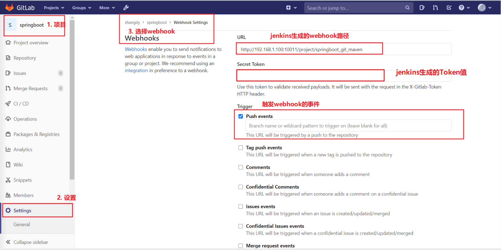

# Jenkins+Git+Maven创建任务

---
[TOC]

---
## 一、要点
　　Jenkins 与 GitHub 配合实现持续集成需要注意以下几点：
>* Jenkins 要部署到外网上，因为内网地址 GitHub 是无法访问到的。这一点可以通过租用阿里云等平台提供的云服务器实现。
>* Jenkins如果在本机，需要使用内网穿透工具，将IP地址+端口暴露给GitHub
>* Jenkins 所在的主机上需要安装 Git，通过 Git 程序从 GitHub 上 clone 代码。
>* 在 Jenkins 内需要指定 Git 程序位置，和指定 JDK、Maven 程序位置非常类似。
>* 在 GitHub 上使用每个 repository 的 WebHook 方式远程触发 Jenkins 构建。
>* 在 Jenkins 内关闭“防止跨站点请求伪造”

本文章需要的前提条件

名称|含义
----|----
Jenkins的Git插件|与服务器的git建立连接
Jenkins的GitHub插件|与GitHub建立连接
Jenkins的Credentials插件|添加登陆GitHub用户凭证，用于jenkins拉去GitHub代码
ngrok|内网穿透工具 [链接](https://ngrok.com/download)

## 二、初始Web Hook
### 1. 什么是webhook?
　　webhooks是一个api概念，是微服务api的使用范式之一，也被成为反向api，即：前端不主动发送请求，完全由后端推送。 举个常用例子，比如你的好友发了一条朋友圈，后端将这条消息推送给所有其他好友的客户端，就是 Webhooks 的典型场景。

　　简单来说，WebHook就是一个接收HTTP POST（或GET，PUT，DELETE）的URL。一个实现了WebHook的API提供商就是在当事件发生的时候会向这个配置好的URL发送一条信息。与请求-响应式不同，使用WebHooks，你可以实时接受到变化。

　　这又是一种对客户机-服务器模式的逆转，在传统方法中，客户端从服务器请求数据，然后服务器提供给客户端数据（客户端是在拉数据）。在Webhook范式下，服务器更新所需提供的资源，然后自动将其作为更新发送到客户端（服务器是在推数据），客户端不是请求者，而是被动接收方。这种控制关系的反转可以用来促进许多原本需要在远程服务器上进行更复杂的请求和不断的轮询的通信请求。通过简单地接收资源而不是直接发送请求，我们可以更新远程代码库，轻松地分配资源，甚至将其集成到现有系统中来根据API的需要来更新端点和相关数据，唯一的缺点是初始建立困难。
### 2. 主要用途 
　　更新客户端，在资源新建或者更新时提供更新的、指定的数据。

### 3. 常见webhooks使用场景 
　　对于第三方平台验权、登陆等 没有前端界面做中转的场景，或者强安全要求的支付场景等，适合用 Webhooks 做数据主动推送。说白了就是在前端无从参与，或者因为前端安全问题不适合参与时，就是 Webhooks 的场景。很显然 Webhooks 也不是 Http 的替代品，不过的确是一种新的前后端交互方式。 

　　如果客户端要长期监听某个任务的状态，按照正常的api调用的方式去做，那么必须不停得轮训服务器来获取当前状态；使用webhook则无需轮训，通过API 可以确定是否发生了更改，如果更改了只需要等待服务器推送信息过来，然后客户端更新就可以。git webhook其实也是这方面的应用。

### 4. 使用说明  
* webhook通过请求发送数据到你的应用后，就不再关注这些数据。也就是说如果你的应用存在问题，数据会丢失。许多webhook会处理回应，如果程序出现错误会重传数据。如果你的应用处理这个请求并且依然返回一个错误，你的应用就会收到重复数据。 
* webhook会发出大量的请求，这样会造成你的应用阻塞。确保你的应用能处理这些请求。


---
---
## 三、添加Git凭证（Add Credentials）
　　Jenkins管理（Manage Jenkins） >> 凭证管理（manage Credentials） >> 

### 1. 点击Jenkins

### 2. 选择全局凭证或者全局凭证旁边的下三角号

### 3. 选择添加凭证

可以添加的凭证有五种：
>* Username with password：用户名和密码
>* SSH Username with private key： 使用SSH用户和密钥
>* Secret file：需要保密的文本文件，使用时Jenkins会将文件复制到一个临时目录中，再将文件路径设置到一个变量中，等构建结束后，所复制的Secret file就会被删除。
>* Secret text：需要保存的一个加密的文本串，如钉钉机器人或Github的api token
>* Certificate：通过上传证书文件的方式

常用的凭证类型有：`Username with password（用户密码）`和`SSH Username with private key（SSH密钥）`

---
## 四、Jenkins内关闭防止跨站点请求伪造


---
---
---
　　下面由两种方式对jenkins自动构建操作，其中jenkins部署在公网的操作步骤待验证，步骤参考网络中其他博客，有条件可以自行验证！！！
`本文以jenkins部署在本地VM为实战！！！！` 本文链接如下：

* [五、Jenkins部署在本地VM](#五、Jenkins部署在本地VM)
* [六、Jenkins部署在公网](#六、Jenkins部署在公网)
---
---

## 五、Jenkins部署在本地VM
###  1. 安装Git
　　安装Git环境，并与jenkins在同一台服务器，Linux操作系统环境安装Git详细步骤参考文章：[Git环境部署(Windows和Linux操作系统环境)](../environmentdeployment/GitInstallREADME.md)

### 2. IP地址进行内网穿透
　　将虚拟机的IP地址+端口号暴露给公网，供公网可以访问的到

软件|下载地址
:---:|:---:
ngrok|[链接](https://ngrok.com/download)
ngrokAPI文档|[链接](https://ngrok.com/docs)
GitHub的WebhookAPI文档|[链接](https://docs.github.com/en/free-pro-team@latest/developers/webhooks-and-events)

　　理解: 因为Jenkins的地址是http://localhost:9093，这个地址只能在本机访问，GitHub是访问不到这个网址的，所以要把本机的9093端口也能让外网访问的到暴露给外网。

打开ngrok.exe文件，运行ngrok.exe

* 在本地启动的jenkins执行如下命令
```
ngrok http 9093
```
* `如果Jenkins是安装在虚拟机VM中`，访问jenkins是有一个虚拟机的IP地址，而不是localhost，那么ngrok的语法应该是：
```shell script
ngrok http https://12.1.1.12:9093
```
　　注意: 这个只能8小时之内有效。通过ngrok得到的URL: http://d01e74e1.ngrok.io

图中的localhost会根据执行的命令变化而变化,比如：

命令|ngrok映射地址
:----:|:----:
ngrok http 9093|https://34313581c5ab.ngrok.io -> http://localhost:9093 
ngrok http https://12.1.1.12:9093|https://34313581c5ab.ngrok.io -> http://12.1.1.12:9093 

### 3. Git的环境配置
　　选择Jenkins管理(manage Jenkins) >> 系统管理(System Configuration)  >> `全局配置（Global Tool Configuration）`

注意：上图中的git路径指定的是如下路径


### 4. 创建Jenkins+Git+Maven项目
#### 4.1 创建任务并配置jenkins拉取GitHub代码配置

　　其他配置暂不配置，此文档主要教程是如何使用Git进行版本控制及jenkins的自动化构建操作

#### 4.2 验证jenkins创建的任务是否可以拉去GitHub代码
　　检查GitHub上的代码是否被Jenkins拉取成功，成功的话证明Git的相关配置是没有问题的！！！


---

　　经验证，上面使用git通过jenkins构建完事了，其他配置与SVN的基本一致，自行参考[Jenkins+SVN+Maven自动化部署](JenkinsSVNMavenREADME.md)

上面使用的方式还是手动触发Jenkins的构建操作，那么如何像SVN一样实现自动化构建操作呢？？？？

---
#### 4.3 配置Jenkins通过Webhook执行自动化构建
* 在项目配置中选中GitHub hook trigger for GITScm polling选项

注：本教程以`GitHub hook trigger for GITScm polling`此选项`为主`

* `或者`在项目配置中选中Generic Webhook Trigger选项


　　Build Triggers选择webhook，这个地址后面配置Git的webHook、GitHub的web hook都会用到，选择哪个都一样，前提是从头到尾必须相互对应，webhook中的地址类似于：

Build Triggers选项|地址
:----:|:----:
Generic Webhook Trigger|http://12.1.1.2:8098/generic-webhook-trigger/invoke?token=12345
GitHub hook trigger for GITScm polling|http://b34190894fc4.ngrok.io/github-webhook/


### 5. Git服务器配置
　　选择Jenkins管理(manage Jenkins) >> 系统管理(System Configuration)  >> `系统配置（Configure system）`

　　图中的GitHub Server的配置是非必须的，可以不配置！！！！直接选中【覆盖Hook URL】，修改IP地址即可！！！

　　下图中的Hook URL地址根据Build Triggers中选中的复选框自行选择！！！！ 这两处的IP地址+端口+URL后缀要与Jenkins任务配置【Build Triggers】选中的复选框一一对应噢！！！


### 6.GitHub配置webhook实现Jenkins自动构建
　　下图中的web hook地址是根据上面Jenkins中选中的复选框相互对应的，不要Jenkins选中【Generic Webhook Trigger】，GitHub填写【GitHub hook trigger for GITScm polling】这个地址，是有问题的！！！


　　配置成功后，GitHub都会有下面的提示，如果配置出现感叹号或者失败标志，请检查填写的URL是否正确！！！


----
　　以上配置只要GitHub的URL和Jenkins的URL配置正确，内网穿透工具ngrok启动基本上就不会有问题。
上面这个是Jenkins在本地环境的情况下，结合GitHub触发Jenkins自动构建的操作步骤，那么Jenkins部署在公网情况下，如何配置呢？？？？

### 7. Gitlab配置webhook实现Jenkins自动构建

1）开启webhook功能 使用root账户登录到后台

点击Admin Area -> Settings -> Network 勾选"Allow requests to the local network from web hooks and services"


2）在项目添加webhook 

点击项目->Settings->Integrations




---
----

## 六、Jenkins部署在公网
### 1. 配置要求
>* Jenkins安装Github插件
>* Jenkins服务器部署在公网，GitHub可以访问jenkins的IP地址
>* 服务器安装Git环境

### 2. jenkins配置webhook
#### 2.1 配置Jenkins通过Webhook执行自动化构建
* 在项目配置中选中GitHub hook trigger for GITScm polling选项

注：本教程以`GitHub hook trigger for GITScm polling`此选项`为主`

* `或者`在项目配置中选中Generic Webhook Trigger选项


#### 2.2 Jenkins指定webhook地址
　　选择Jenkins管理(manage Jenkins) >> 系统管理(System Configuration)  >> `系统配置（Configure system）`

　　这里面的地址是访问Jenkins的地址，jenkins在公网的情况下，一般会自动生成的！！！！`这个URL地址的后缀根据上面选择操作变化而变化`

Build Triggers选项|地址
:----:|:----:
Generic Webhook Trigger|http://12.1.1.2:8098/generic-webhook-trigger/invoke?token=12345
GitHub hook trigger for GITScm polling|http://b34190894fc4.ngrok.io/github-webhook/


### 3. GitHub配置webhook
　　将Jenkins通过Hook生成出来的地址复制，并粘贴到下图GitHub中Webhooks的URL位置！！！其他选择默认即可，如有特殊需求，可选择【letme select indivdual events】


### 4. 保存（update webhook）成功后，如下图所示


## 七、写在最后
　　`不管jenkins是部署在公网还是本地地址`，Jenkins任务配置中的Build Triggers选项，关于webhook的两个复选框都选中也没有问题，主要是

　　Jenkins管理(manage Jenkins) >> 系统管理(System Configuration)  >> `系统配置（Configure system）`中Hook URL与GitHub地址相对应就好！！！

Build Triggers选项|Jenkins Hook URL地址|GitHub Web Hooks地址
:----|:----|:----
Generic Webhook Trigger|http://12.1.1.2:8098/generic-webhook-trigger/invoke?token=12345|http://12.1.1.2:8098/generic-webhook-trigger/invoke?token=12345
GitHub hook trigger for GITScm polling|http://b34190894fc4.ngrok.io/github-webhook/|http://b34190894fc4.ngrok.io/github-webhook/

## 八、关于Jenkins+Git+pipeline项目
　　对于流水线项目，使用GitHub通过web hook触发jenkins自动构建，操作方式基本与maven项目的一致，参照本文教程自己创建一个pipeline项目看一眼就知道了！！！！

---
---
---
## 相关链接

* `项目在Github中查看`，点击Github连接；
* `项目下载到本地`，点击本地链接。

序号|Github链接|本地链接|README路径
:---|:---|:---|:---
1|[初识Jenkins](https://github.com/ZHoodLum/software-architect/blob/master/src/main/java/jenkins/JenkinsHelloWorldREADME.md)|[初识Jenkins](JenkinsHelloWorldREADME.md)|/src/main/java/jenkins/JenkinsHelloWorldREADME.md
2|[Jenkins环境安装](https://github.com/ZHoodLum/software-architect/blob/master/src/main/java/jenkins/JenkinsInstalREAMDE.md)|[Jenkins环境安装](JenkinsInstalREADME.md)|/src/main/java/jenkins/JenkinsInstalREAMDE.md
3|[Jenkins+SVN+Maven创建任务](https://github.com/ZHoodLum/software-architect/blob/master/src/main/java/jenkins/JenkinsSVNMavenREADME.md)|[Jenkins+SVN+Maven创建任务](JenkinsSVNMavenREADME.md)|/src/main/java/jenkins/JenkinsSVNMavenREADME.md
4|[Jenkins+SVN+Maven+Pipeline创建任务](https://github.com/ZHoodLum/software-architect/blob/master/src/main/java/jenkins/JenkinsSVNMavenPipelineREADME.md)|[Jenkins+SVN+Maven+Pipeline创建任务](JenkinsSVNMavenPipelineREADME.md)|/src/main/java/jenkins/JenkinsSVNMavenPipelineREADME.md
5|[`Jenkins+Git+Maven+Pipeline创建任务`](https://github.com/ZHoodLum/software-architect/blob/master/src/main/java/jenkins/JenkinsGitMavenREADME.md)|[Jenkins+Git+Maven+Pipeline创建任务](JenkinsGitMavenREADME.md)|/src/main/java/jenkins/JenkinsGitMavenREADME.md
6|[Jenkins细节优化](https://github.com/ZHoodLum/software-architect/blob/master/src/main/java/jenkins/JenkinsOptimizationREADME.md)|[Jenkins细节优化](JenkinsOptimizationREADME.md)|/src/main/java/jenkins/JenkinsOptimizationREADME.md
