# Jenkins环境安装、部署

## 目录
@[TOC](可改名称)

---
---
---

## 环境准备
以下环境最好与项目保持一致！！！

安装文件|版本|下载地址一|下载地址一|备注
:---:|:---|:---:|:---:|:---
VM 虚拟机|VMware Workstation 15|[下载](https://my.vmware.com/cn/web/vmware/downloads/info/slug/desktop_end_user_computing/vmware_workstation_pro/15_0)
JDK|jdk-8u271-linux-x64.tar.gz|[国内镜像下载](https://mirrors.tuna.tsinghua.edu.cn/AdoptOpenJDK/8/jdk/x64/linux/)|[官方地址下载](https://www.oracle.com/java/technologies/javase/javase-jdk8-downloads.html)
tomcat|apache-tomcat-8.5.61.tar.gz|[下载](https://tomcat.apache.org/download-80.cgi)|&nbsp;|非必需，Jenkins是否需要通过Tomcat启动
maven|apache-maven-3.3.9-bin.tar.gz|[下载](https://mirrors.tuna.tsinghua.edu.cn/apache/maven/maven-3/3.3.9/source/)
SVN|Subversion 1.12.2|[下载](https://mirrors.tuna.tsinghua.edu.cn/apache/subversion/)|&nbsp;|本地需安装Subversion，用于提交项目；SVN服务器可以安装在本地(宿主机)的或者服务器上，用于管理版本
jenkins|jenkins 2.273|[下载](http://updates.jenkins-ci.org/download/war/)|&nbsp;|jenkins可以通过tomcat、docker、war包形式启动，本次使用war包的形式直接启动jenkins

---

## 1.Jenkins启动
我这⾥下载的是 jenkins.war 安装包
### 一、创建⽬录 /usr/local/jenkins
在 /usr/local/ 下创建 jenkins ⽂件夹并进⼊，通过SFTP将 jenkins.war 安装包上传到该目录（/usr/local/jenkins）下，也可以自行选择文件位置
```shell script
cd /usr/local/
mkdir jenkins
cd jenkins
```
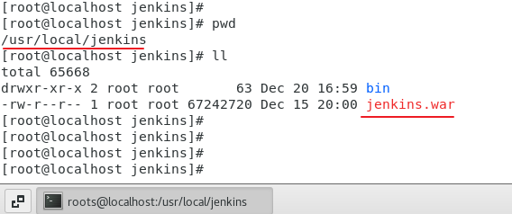
### 二、启动Jenkins
### 1. 第一种启动方式（直接使用war启动）
```
java -jar jenkins.war --httpPort=8888
```
war中自带jetty服务器，--httpPort指定启动端，启动后访问地址：
```shell script
190.18.2.17:9093
```


以这种方式启动是要占用ssh，关闭就无法访问了，所以我把它写成启动脚本，操作如下：

### 在目录（/usr/local/jenkins）下创建文件夹 bin ,并新增文件jenkins.sh

```shell script
mkdir bin
cd bin
vim jenkins.sh
```
### jenkins.sh脚本内容如下：
```shell script
#!/bin/sh

#jenkins start
START_PORT="--httpPort=9093"
JAVA_PATH="/usr/local/java/jdk1.8.0_271/bin/java"
PROJECT_PATH=$(cd "$(dirname "$0")";cd ..;pwd)
START_FILE=${PROJECT_PATH}/jenkins.war
nohup ${JAVA_PATH} -jar ${START_FILE} ${START_PORT} & 2>&1
tail -f nohup.out
```
### 采用后台挂起启动方式,输入如下命令就可以启动啦！！！
```shell script
./jenkins.sh
```
### 2. 第二种启动方式（通过Tomcat启动Jenkins）
### 将 jenkins.war放进tomcat的webapp下，然后启动tomcat
启动后访问地址：
```shell script
190.18.2.17:8080/jenkins
```
### 3. 第二种启动方式（通过docker启动Jenkins）
待补充.......

---

## Jenkins配置（解锁 jenkins）
访问地址：190.18.2.17:9093。进入jenkins界面
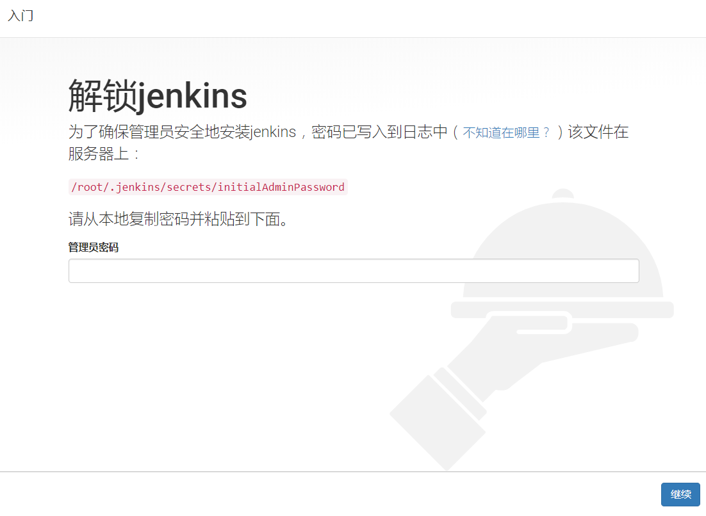
管理员密码已写入日志中，该文件在
```shell script
less /root/.jenkins/secrets/initialAdminPassword

cb64bc4820c1495187cae9291f6f30e6
```
密文同时也是 admin 账号的密码,输入后点击【继续】按钮

注：输入密码可以查看这个网址有具体说明，不同环境下取密码的方式
[链接](https://www.jenkins.io/doc/book/system-administration/viewing-logs/)


### 一、选择插件安装方式
输入密文后，初始化后，选择插件安装方式（选择哪种方式都不会对后续操作有太大影响。因为有需要的插件我们可以在后续有针对性的安装）。在这里选择“安装推荐的插件”。
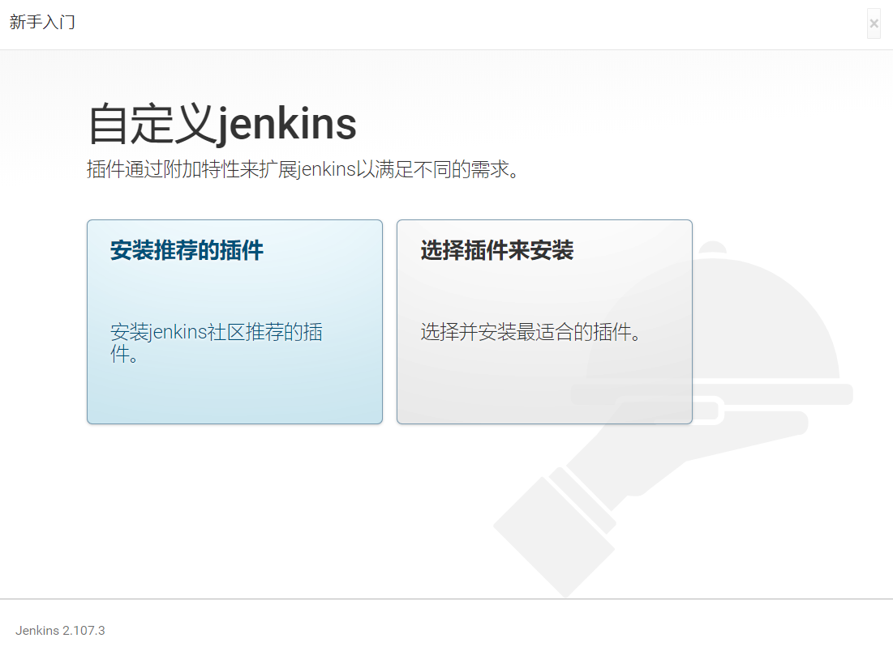
这里选择的是【安装推荐的插件】

>* 打×的插件是由于网络传输导致的安装失败，后面再重新安装即可。
>* ※注意：这个步骤中如果选择了安装插件则 Linux 必须能够联网。
>
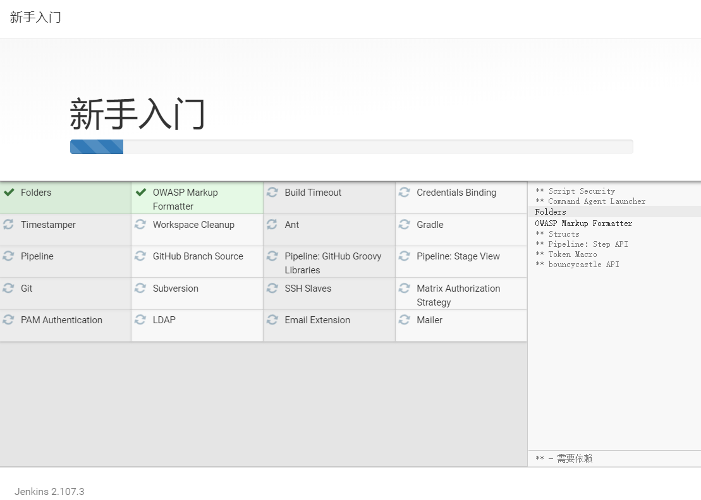

---
### 二、新建账号 或者 以管理员身份继续
* 可以选择使用 admin 账户继续，后面有需要仍然有机会注册新账户
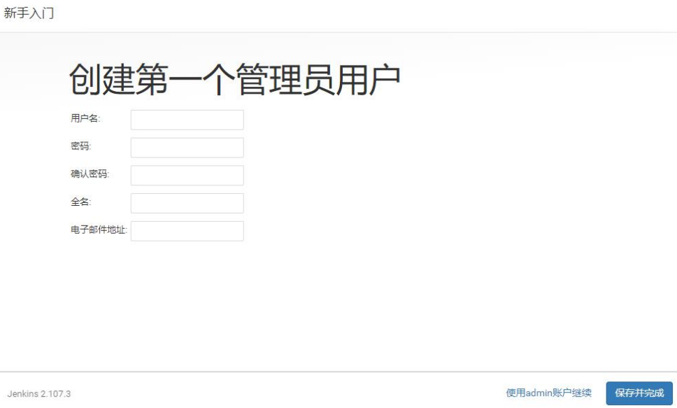

* 后续新增用于菜单路径如下：
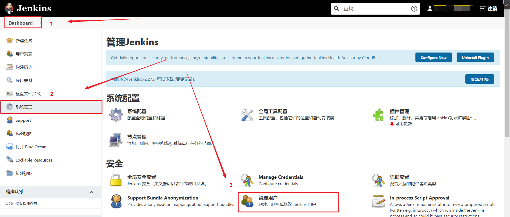
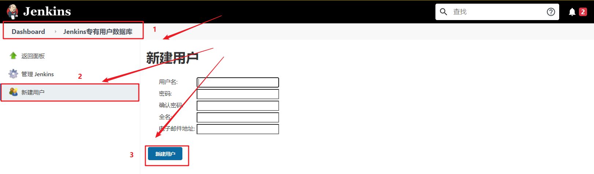

---
### 三、开始使用 jenkins 
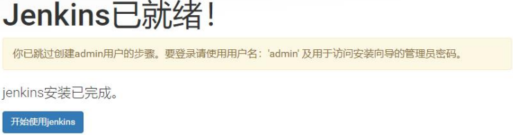

---
### 四、Jenkins系统化配置
### 1. Jenkins中文配置（不需要中文可跳过）
注：v2.176.3默认是英文的，若想转为中文版本（但还是不完全中文），可以在插件管理中安装插件——Localization: Chinese (Simplified)，Jenkins任何插件安装成功，需重启才能生效
> 主界面-->系统管理（Manage jenkins）-->插件管理（Manage Plugins）-->可选插件（available）中找到Localization: Chinese (Simplified)插件进行安装

已安装的打上对勾后重启jenkins即可
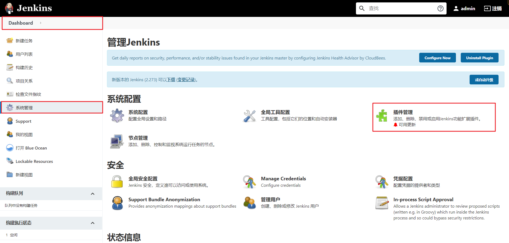
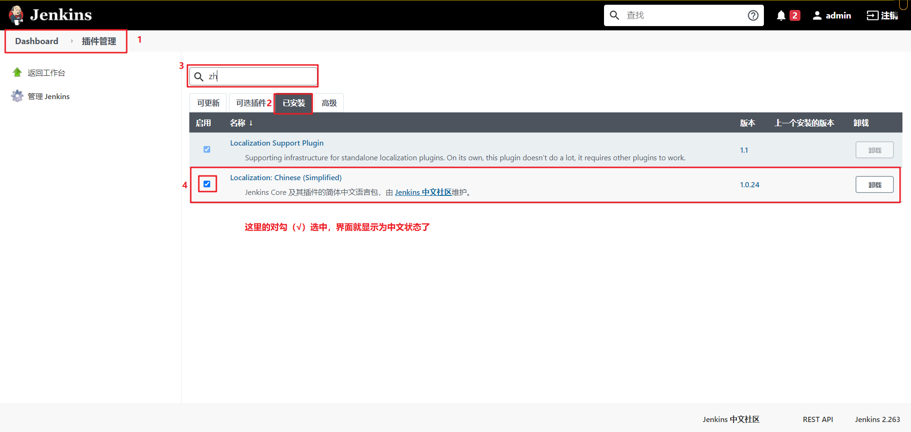

### 2. 全局安全配置（Configure Global Security）
注意：下图中的授权策略，生产环境最好不要使用【任何用户可以做任何事】


### 3. 全局工具配置（Global Tool Configuration）
下图中的Maven、git或者SVN、JDK环境都是事先安装好的

注：配置git或者SVN取决于项目使用的版本控制工具，SVN在Jenkins中不需要配置，安装好插件就行
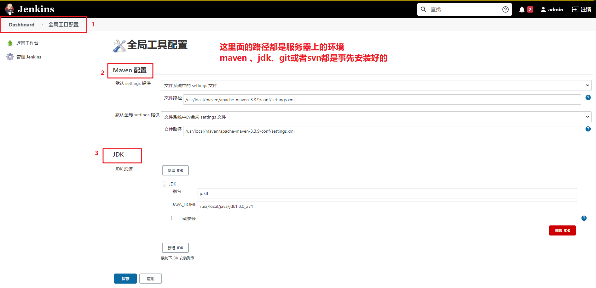

#### Maven Configuration配置
>* Default settings provider = Settings file in filesystem]
>* File path = /usr/local/maven/apache-maven-3.3.9/conf/settings.xml

>* Default global settings provider = Global settings file on filesystem
>* File path = /usr/local/maven/apache-maven-3.3.9/conf/settings.xml

#### JDK配置
>* Name = jdk8（名字可以随便起）
>* JAVA_HOME = /usr/local/java/jdk1.8.0_271

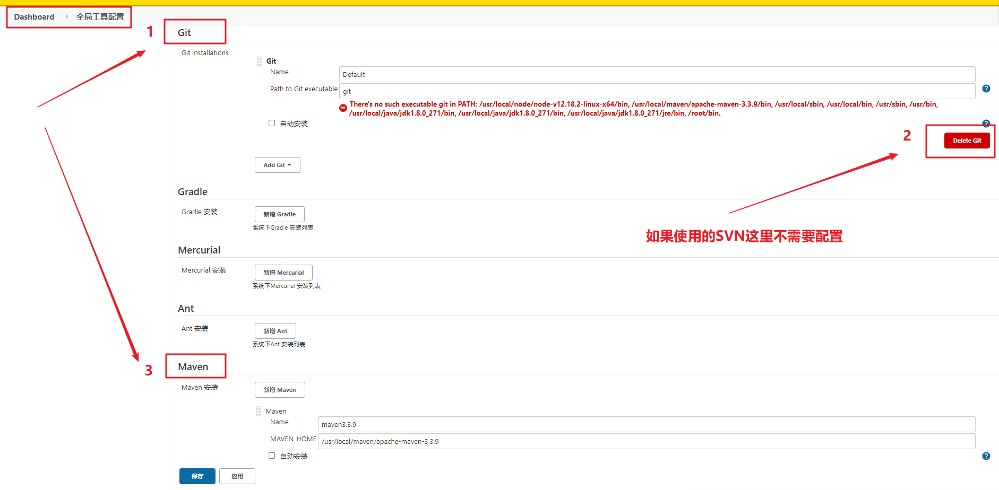
#### Maven配置
>* Name = maven3.3.9（名字可以随便起）
>* MAVEN_HOME = /usr/local/maven/apache-maven-3.3.9

### 4. 常用插件安装
> 主界面 >> 系统管理(Manage jenkins) >> 插件管理(Manage Plugins) >> 可选插件(available)进行插件的安装

插件名称|作用
:------|:---------
Deploy to container Plugin|将应用（项目）发布到tomcat下
Subversion Plug-in|版本管理使用SVN时需要安装，Jenkins官方集成版本工具是git
Git plugin|使用jeknkins选择推荐安装，jenkins初始化时候会安装此插件
Post Build task|构建成功后的需要执行操作，比如：用于执行shell脚本
Publish Over SSH|说明：远程部署时需要，和Jenkins不在同一个服务器上时，可以不安装此插件；建议安装，使用pipeline流水线方式工作时，方便执行shell脚本
Pipeline|流水线工作插件，将jenkins分部操作形成流水线，创建任务时选择流水线工程即可
Blue Ocean|蓝色的海洋，CI/CD pipeline（持续集成、交付、部署 流水线）可视化界面，流水线的可视化界面
disable_output_color|Jenkins控制台日志变色色
Maven Integration|创建Maven任务需要此插件（jenkins有7中创建任务方式，比如：流水线、自由风格、maven、多分支流水线等等）

### 好了，jenkins环境的基本配置部署完毕，接下来的操作是创建任务，创建项目，开始自动化部署操作！！！！

---
---
---
[二、Jenkins创建Maven任务](JenkinsCreateMavenProjectREMADE.md)

[三、Jenkins创建Pipeline任务](JenkinsCreatePipelineProjectREMADE.md)


