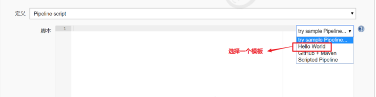
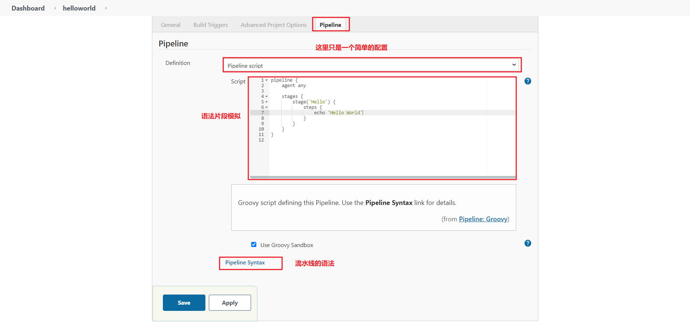
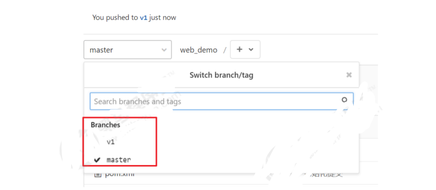

# Jenkins细节优化
> 本片文章部分内容参照PDFJenkins持续集成从入门到精通_黑马程序员.pdf [链接](../../resources/PDF/Jenkins持续集成从入门到精通_黑马程序员.pdf)

[TOC]

----
----
## 一、常用的构建触发器
### Jenkins内置4种构建触发器：
>* 触发远程构建
>* 其他工程构建后触发（Build after other projects are build）
>* 定时构建（Build periodically）
>* 轮询SCM（Poll SCM）

### 1. 触发远程构建
触发构建url：
```
http://192.168.66.101:8888/job/web_demo_pipeline/build?token=6666
```
#### 自动构建地址URL说明
成员|含义
:--- | :---
`http://11.18.1.12:8080`|访问jenkins的地址
`/job`|固定成员，可查看当前【任务配置】界面的URL的地址 `http://11.18.1.12:8080/job/projectName/configure`
`/projectName`|项目名称，也可查看任务配置界面的URL前一部分
`/build?token=`|固定成员，详情可查看图片中token下面的规则，有注释
`12345`|token值，这里为了测试输入的12345，此处的值也可以是加密的值


### 2. 其他工程构建后触发
#### 2.1 创建pre_job流水线工程



#### 2.2 配置需要触发的工程


### 3. 定时构建


#### 定时构建语法
`* * * * * `（五颗星，多个时间点，中间用逗号隔开）

任务含义|参数
:--- | :---
第一个表示分钟|取值0~59
第二个表示小时|取值0~23
第三个表示一个月的第几天|取值1~31
第四个表示第几月|取值1~12
第五个*表示一周中的第几天|取值0~7，其中0和7代表的都是周日
每5分钟构建一次|H/5 * * * *
每15分钟运行一次|H/15 * * * *
每30分钟构建一次|H/30 * * * *
每2小时构建一次|H H/2 * * *
每天早上8点构建一次|0 8 * * *
每天中午下班前定时构建一次|0 12 * * *
每天下午下班前定时构建一次|0 18 * * *
每天的8点，12点，22点，一天构建3次|0 8,12,22 * * *
一个小时的前30分钟，每10分钟运行一次 (30分钟, 可能在 4分，14分，24分)|H(0-29)/10 * * * *
每周一至周五，上午9:45到下午3:45，每隔2小时45分钟运行一次|45 9-15/2 * * 1-5
每两小时一次，每个工作日上午9点到下午5点(也许是上午10:38，下午12:38，下午2:38，下午4:38)|H H(9-17)/2 * * 1-5
除12月外，每月1号和15号每天一次|H H 1,15 1-11 *

#### 4. 轮询SCM
轮询SCM，是指定时扫描本地代码仓库的代码是否有变更，如果代码有变更就触发项目构建。

注意：这次构建触发器，Jenkins会定时扫描本地整个项目的代码，增大系统的开销，不建议使用。

#### 5. Build periodically(定时构建)与Poll SCM（轮询构建）区别
* Build periodically：任务周期性进行项目构建，这个是到指定的时间必须触发构建任务（无论SVN中数据有无变化，均执行定时化的构建）
* Poll SCM：
>* Poll SCM:定时检查源码变更（根据SCM软件的版本号），如果有更新就checkout最新code下来，然后执行构建动作（定时轮询SVN，查看SVN中是否有数据变化，如果有变化，则执行构建任务）
>* 如果我想每隔5分钟检查一次源码变化，SVN更新代码了才会执行Jenkins构建操作

----

## 二、Git hook自动触发构建
刚才我们看到在`Jenkins的内置构建触发器`中，轮询SCM可以实现Gitlab（或者GitHub）代码更新，项目自动构建，但是该方案的性能不佳。那有没有更好的方案呢？
 有的。就是利用Gitlab（或者GitHub）的`webhook`实现代码`push`到仓库，立即触发项目`自动构建`。
 

### 1. Jenkins安装版本控制插件
根据版本控制自行选择以下的Jenkins插件

名称|Jenkine插件
:---:|:---:
Gitlab仓库|Gitlab Hook、GitLab
GitHub仓库|Git plugin、GitHub plugin
钩子Webhook自动触发构建功能|Generic Webhook Trigger

### 2. Jenkins设置自动构建
 

等会需要把生成的webhook URL配置到Gitlab中。

### 3. Gitlab配置webhook
#### 3.1 开启webhook功能
使用root账户登录到后台，点击Admin Area >> Settings >> Network

`勾选"Allow requests to the local network from web hooks and services"`


 

#### 3.2 在项目添加webhook
点击项目 >> Settings >> Integrations


` 注意：以下设置必须完成，否则会报错！`

 Manage Jenkins >> Configure System


---
## 三、Jenkins的参数化构建 
有时在项目构建的过程中，我们需要根据用户的输入动态传入一些参数，从而影响整个构建结果，这时我们可以使用参数化构建。

### 1. Jenkins支持非常丰富的参数类型

接下来演示通过输入gitlab项目的分支名称来部署不同分支项目。

### 2. 项目创建分支，并推送到Gitlab上

新建分支：v1，代码稍微改动下，然后提交到gitlab上。这时看到gitlab上有一个两个分支：master和v1

### 3. 在Jenkins添加字符串类型参数


### 4. 改动pipeline流水线代码

### 5. 点击Build with Parameters

### 6. 输入分支名称，构建即可！构建完成后访问Tomcat查看结果

---
## 四、配置邮箱服务器发送构建结果
### 1. 安装Email Extension插件


### 2. Jenkins设置邮箱相关参数
Manage Jenkins >> Configure System


### 3. 设置邮件参数


### 4. 设置Jenkins默认邮箱信息


### 5. 准备邮件内容
在项目根目录编写email.html，并把文件推送到Gitlab，内容如下

```html
<!DOCTYPE html>
<html>
<head>
    <meta charset="UTF-8">
    <title>${ENV, var="JOB_NAME"}-第${BUILD_NUMBER}次构建日志</title>
</head>
<body leftmargin="8" marginwidth="0" topmargin="8" marginheight="4"
      offset="0">
<table width="95%" cellpadding="0" cellspacing="0"
       style="font-size: 11pt; font-family: Tahoma, Arial, Helvetica, sansserif">
    <tr>
        <td>(本邮件是程序自动下发的，请勿回复！)</td>
    </tr>
    <tr>
        <td><h2>
            <font color="#0000FF">构建结果 - ${BUILD_STATUS}</font>
        </h2></td>
    </tr>
    <tr>
        <td><br/>
            <b><font color="#0B610B">构建信息</font></b>
            <hr size="2" width="100%" align="center"/>
        </td>
    </tr>
    <tr>
        <td>
            <ul>
                <li>项目名称&nbsp;：&nbsp;${PROJECT_NAME}</li>
                <li>构建编号&nbsp;：&nbsp;第${BUILD_NUMBER}次构建</li>
                <li>触发原因：&nbsp;${CAUSE}</li>
                <li>构建日志：&nbsp;<a
                        href="${BUILD_URL}console">${BUILD_URL}console</a></li>
                <li>构建&nbsp;&nbsp;Url&nbsp;：&nbsp;<a
                        href="${BUILD_URL}">${BUILD_URL}</a></li>
                <li>工作目录&nbsp;：&nbsp;<a
                        href="${PROJECT_URL}ws">${PROJECT_URL}ws</a></li>
                <li>项目&nbsp;&nbsp;Url&nbsp;：&nbsp;<a
                        href="${PROJECT_URL}">${PROJECT_URL}</a></li>
            </ul>
        </td>
    </tr>
    <tr>
        <td>
            <b><font color="#0B610B">Changes Since Last Successful Build:</font></b>
            <hr size="2" width="100%" align="center"/>
        </td>
    </tr>
    <tr>
        <td>
            <ul>
                <li>历史变更记录 : <a href="${PROJECT_URL}changes">${PROJECT_URL}changes</a></li>
            </ul>
            ${CHANGES_SINCE_LAST_SUCCESS,reverse=true, format="Changes for Build #%n:<br/>%c<br/>"
            ,showPaths=true,changesFormat="
            <pre>[%a]<br/>%m</pre>
            ",pathFormat="&nbsp;&nbsp;&nbsp;&nbsp;%p"}
        </td>
    </tr>
    <tr>
        <td><b>Failed Test Results</b>
            <hr size="2" width="100%" align="center"/>
        </td>
    </tr>
    <tr>
        <td>
            <pre style="font-size: 11pt; font-family: Tahoma, Arial, Helvetica,sans-serif">$FAILED_TESTS</pre>
            <br/></td>
    </tr>
    <tr>
        <td>
            <b><font color="#0B610B">构建日志 (最后 100行):</font></b>
            <hr size="2" width="100%" align="center"/>
        </td>
    </tr>
    <tr>
        <td><textarea cols="80" rows="30" readonly="readonly" style="font-family: Courier New">${BUILD_LOG,maxLines=100}</textarea>
        </td>
    </tr>
</table>
</body>
</html>
```

### 6. 编写Jenkinsfile添加构建后发送邮件
```shell script
pipeline {
    agent any
    stages {
        stage('拉取代码') {
            steps {
                checkout([$class: 'GitSCM', branches: [[name: '*/master']],
                doGenerateSubmoduleConfigurations: false, extensions: [], submoduleCfg: [],
                userRemoteConfigs: [[credentialsId: '68f2087f-a034-4d39-a9ff-1f776dd3dfa8', url:
                'git@192.168.66.100:itheima_group/web_demo.git']]])
            }
        }
        stage('编译构建') {
            steps {
              sh label: '', script: 'mvn clean package'
            }
        }
        stage('项目部署') {
            steps {
                deploy adapters: [tomcat8(credentialsId: 'afc43e5e-4a4e-4de6-984fb1d5a254e434', path: '', url: 'http://192.168.66.102:8080')], contextPath: null,
                war: 'target/*.war'
            }
        }
    }
    post {
        always {
            emailext(
                subject: '构建通知：${PROJECT_NAME} - Build # ${BUILD_NUMBER} -
                ${BUILD_STATUS}!',
                body: '${FILE,path="email.html"}',
                to: 'xxx@qq.com'
            )
        }
    }
}
```

### 7. 测试


### 8. 邮件相关全局参数参考列表：
系统设置 >> Extended E-mail Notification >> Content Token Reference，点击旁边的`?号`


## 五、添加Git凭证（Add Credentials）

　　Jenkins管理（Manage Jenkins） >> 凭证管理（manage Credentials） >> 

### 1. 点击Jenkins


### 2. 选择全局凭证或者全局凭证旁边的下三角号


### 3. 选择添加凭证


可以添加的凭证有五种：

>* Username with password：用户名和密码
>* SSH Username with private key： 使用SSH用户和密钥
>* Secret file：需要保密的文本文件，使用时Jenkins会将文件复制到一个临时目录中，再将文件路径设置到一个变量中，等构建结束后，所复制的Secret file就会被删除。
>* Secret text：需要保存的一个加密的文本串，如钉钉机器人或Github的api token
>* Certificate：通过上传证书文件的方式

常用的凭证类型有：`Username with password（用户名密码）`和`SSH Username with private key（SSH密钥）`


### 4. 通过凭证登录方式

#### 4.1 使用用户名密码登录

凭证类型选择`Username with password`，输入正确的用户名和密码即可！！


#### 4.2 使用SSH密钥（登录GitLab为例）

SSH密钥类型


1）使用root用户生成公钥和私钥

```
ssh-keygen -t rsa
```

在/root/.ssh/目录保存了公钥和使用

> * id_rsa：私钥文件

> * id_rsa.pub：公钥文件

2）把生成的公钥放在Gitlab中

以root账户登录 >> 点击头像 >> Settings >> SSH Keys 

复制刚才id_rsa.pub文件的内容到这里，点击"Add Key"

**复制命令：**

```
clip</root/.ssh/id_rsa.pub
```


3）在Jenkins中添加凭证，配置私钥

在Jenkins添加一个新的凭证，类型为"SSH Username with private key"，把刚才生成私有文件内容复 制过来。

**复制命令：**

```
clip</root/.ssh/id_rsa
```

---
---
---
## 相关链接

* `项目在Github中查看`，点击Github连接；
* `项目下载到本地`，点击本地链接。

序号|Github链接|本地链接|README路径
:---|:---|:---|:---
1|[初识Jenkins](https://github.com/ZHoodLum/software-architect/blob/master/src/main/java/jenkins/JenkinsHelloWorldREADME.md)|[初识Jenkins](JenkinsHelloWorldREADME.md)|/src/main/java/jenkins/JenkinsHelloWorldREADME.md
2|[Jenkins环境安装](https://github.com/ZHoodLum/software-architect/blob/master/src/main/java/jenkins/JenkinsInstalREAMDE.md)|[Jenkins环境安装](JenkinsInstalREADME.md)|/src/main/java/jenkins/JenkinsInstalREAMDE.md
3|[Jenkins+SVN+Maven创建任务](https://github.com/ZHoodLum/software-architect/blob/master/src/main/java/jenkins/JenkinsSVNMavenREADME.md)|[Jenkins+SVN+Maven创建任务](JenkinsSVNMavenREADME.md)|/src/main/java/jenkins/JenkinsSVNMavenREADME.md
4|[Jenkins+SVN+Maven+Pipeline创建任务](https://github.com/ZHoodLum/software-architect/blob/master/src/main/java/jenkins/JenkinsSVNMavenPipelineREADME.md)|[Jenkins+SVN+Maven+Pipeline创建任务](JenkinsSVNMavenPipelineREADME.md)|/src/main/java/jenkins/JenkinsSVNMavenPipelineREADME.md
5|[Jenkins+Git+Maven+Pipeline创建任务](https://github.com/ZHoodLum/software-architect/blob/master/src/main/java/jenkins/JenkinsGitMavenREADME.md)|[Jenkins+Git+Maven+Pipeline创建任务](JenkinsGitMavenREADME.md)|/src/main/java/jenkins/JenkinsGitMavenREADME.md
6|[`Jenkins细节优化`](https://github.com/ZHoodLum/software-architect/blob/master/src/main/java/jenkins/JenkinsOptimizationREADME.md)|[Jenkins细节优化](JenkinsOptimizationREADME.md)|/src/main/java/jenkins/JenkinsOptimizationREADME.md


