# Jenkins+SVN+Maven+Pipeline创建任务

> 注：以下操作环境需要Jenkins安装插件【Blue Ocean】，方便观看

---
[TOC]


## 一、简介

Pipeline，简单来说，就是一套运行在 Jenkins 上的工作流框架，将原来独立运行于单个或者多个节点
的任务连接起来，实现单个任务难以完成的复杂流程编排和可视化的工作。

Jenkins 2.x的精髓是Pipeline as Code，那为什么要用Pipeline呢？jenkins1.0也能实现自动化构建，
但Pipeline能够将以前project中的配置信息以steps的方式放在一个脚本里，将原本独立运行于单个或者多个节点的任务连接起来，
实现单个任务难以完成的复杂流程，形成流水式发布，构建步骤视图化。简单来说，`Pipeline适用的场景更广泛，能胜任更复杂的发布流程。`

举个例子，`job构建工作在master节点，自动化测试脚本在slave节点，这时候jenkins1.0就无法同时运行两个节点，而Pipeline可以。`

---
## 二、使用Pipeline有以下好处（来自翻译自官方文档）：
>* 代码：Pipeline以代码的形式实现，通常被检入源代码控制，使团队能够编辑，审查和迭代其传送流程。 
>* 持久：无论是计划内的还是计划外的服务器重启，Pipeline都是可恢复的。 
>* 可停止：Pipeline可接收交互式输入，以确定是否继续执行Pipeline。 
>* 多功能：Pipeline支持现实世界中复杂的持续交付要求。它支持fork/join、循环执行，并行执行任务的功能。 
>* 可扩展：Pipeline插件支持其DSL的自定义扩展 ，以及与其他插件集成的多个选项。

## 三、如何创建 Jenkins Pipeline呢？
>* Pipeline 脚本是由 `Groovy 语言`实现的，但是我们没必要单独去学习 Groovy
>* Pipeline 支持两种语法：`Declarative Pipeline(声明式)`和 `Scripted Pipeline(脚本式)语法`
>* Pipeline 也有两种创建方法：可以直接在 Jenkins 的 Web UI 界面中输入脚本；也可以通过创建一个 Jenkinsfile 脚本文件放入项目源码库中（一般我们都推荐在 Jenkins 中直接从源代码控制(SCM)中直接载入 Jenkinsfile Pipeline 这种方法）。

下面会有语法的说明！！！！

---
## 四、基本概念
* Stage: 阶段，一个Pipeline可以划分为若干个Stage，每个Stage代表一组操作。注意Stage是一个逻辑分组的概念，可以跨多个Node。
* Node: 节点，一个Node就是一个Jenkins节点，或者是Master，或者是slave，是执行Step的具体运行期环境。
* Step: 步骤，Step是最基本的操作单元，小到创建一个目录，大到构建一个Docker镜像，由各类Jenkins Plugin提供。
### 1. Jenkins样图如下：
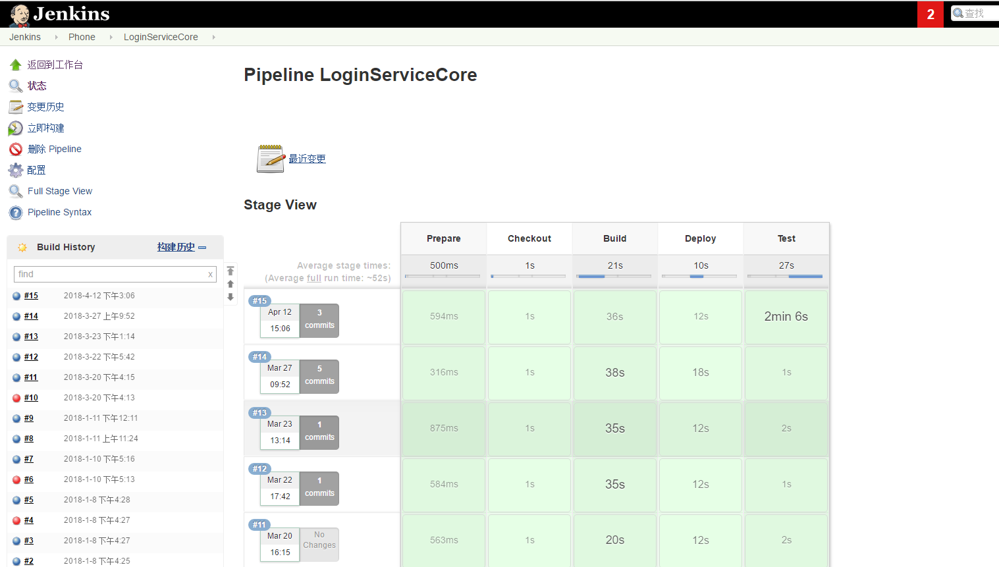
### 2. Blue Ocean样图如下：
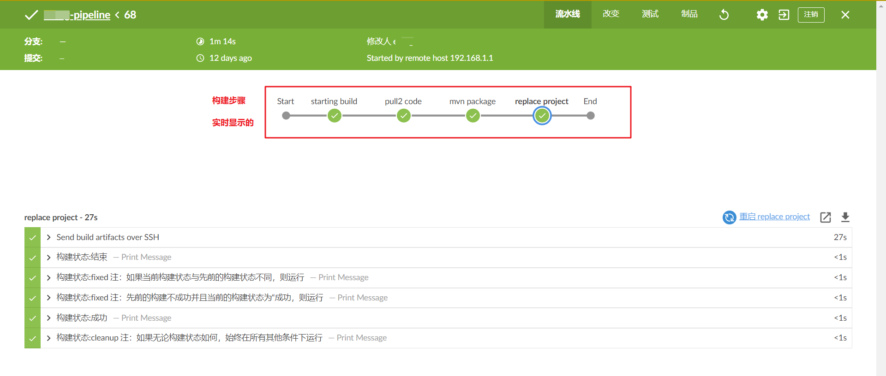

---
## 五、Pipeline(Groovy)语法块说明
Pipeline支持两种语法：`Declarative Pipeline(声明式，在Pipeline 2.5中引入，结构化方式）`和`Scripted Pipeline(脚本式)语法`，两者都支持建立连续输送的Pipeline。
* 1）共同点：两者都是pipeline代码的持久实现，都能够使用pipeline内置的插件或者插件提供的steps，两者都可以利用共享库扩展。
* 2）区别：两者不同之处在于语法和灵活性。
>* Declarative pipeline对用户来说，语法更严格，有固定的组织结构，更容易生成代码段，使其成为用户更理想的选择。
>* 但是Scripted pipeline更加灵活，因为Groovy本身只能对结构和语法进行限制，对于更复杂的pipeline来说，用户可以根据自己的业务进行灵活的实现和扩展。

那么如何在Jenkins使用该语法呢？接着往下走，我们会在项目实战中使用上面描述的这些内容.....

---
## 六、项目创建
### 1. 安装Pipeline插件
Manage Jenkins >> Manage Plugins >> 可选插件 >> 选择插件`Pipeline`

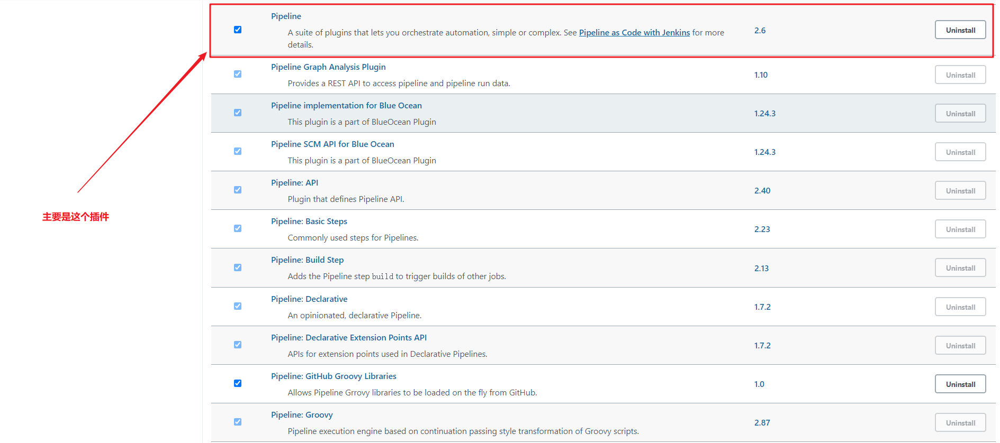
安装插件后，创建项目时候就可以选择【流水线】类型的任务了！！！！

### 2. 创建hello world项目
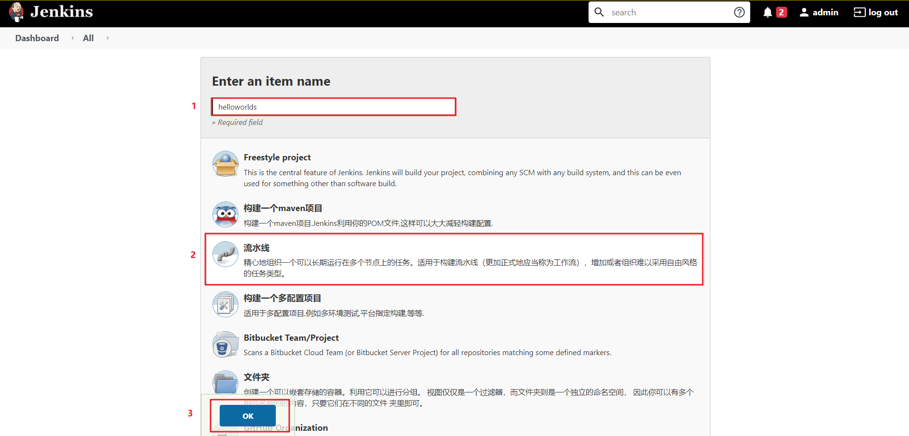
创建成功后，项目配置界面如下：
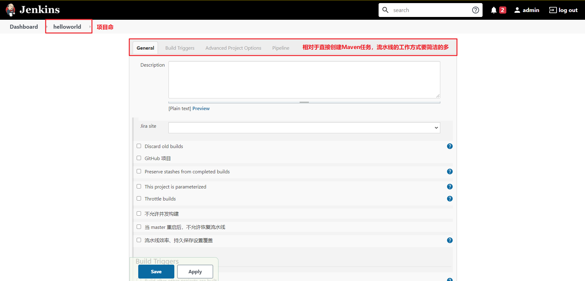

### 3. 初始化项目配置

### 3.1 General
>* 这里没有进行其他配置，只是对项目进行描述

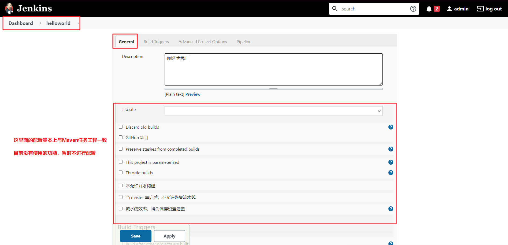

### 3.2 构建触发器（Build Triggers）
>* 这里需要使用token值，用于SVN自动触发Jenkins构建操作

### 3.3项目高级参数（Advanced Project Options）
>* 这里没有进行其他配置，可自行配置

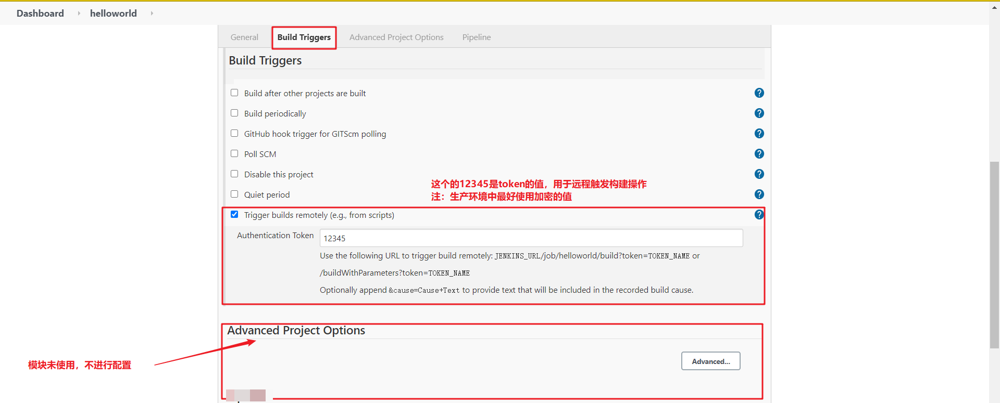

### 3.4 流水线（Pipeline）
上面介绍到了流水线中有两种语法：声明式和脚本式，那么如何使用呢？ 创建方式如下：

>* 声明式语法（try sample pipeline）

选择 流水线 >> Hello World（属于声明式语法 或者选择try sample pipeline）

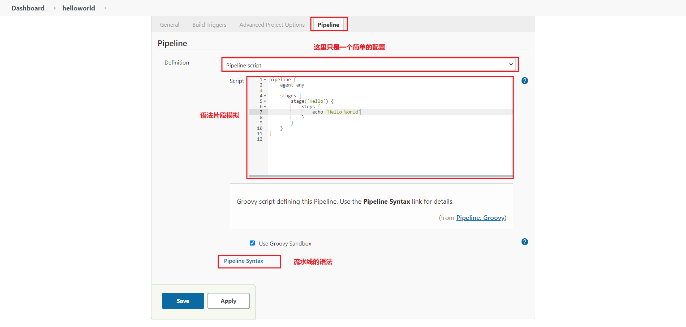
生成的内容如上图所示,代码块如下：
```shell script
pipeline {
    agent any
    stages {
        stage('Hello') {
            steps {
              echo 'Hello World'
            }
        }
    }
}
```
#### 3.4.1 声明式语法节点说明
* stages：代表整个流水线的所有执行阶段。通常stages只有1个，里面包含多个stage
* stage：代表流水线中的某个阶段，可能出现n个。一般分为拉取代码，编译构建，部署等阶段。
* steps：代表一个阶段内需要执行的逻辑。steps里面是shell脚本，git拉取代码，ssh远程发布等任意内
容。

编写一个简单声明式 try sample Pipeline：
```groovy
pipeline {
    agent any
    stages {
        stage('拉取代码') {
            steps {
                echo '拉取代码'
            }
        }
        stage('编译构建') {
            steps {
                echo '编译构建'
            }
        }
        stage('项目部署') {
            steps {
                echo '项目部署'
            }
        }
    }
}
```
效果图如下：

声明式语法还可以参照官方，[地址链接](https://www.jenkins.io/zh/doc/)


>* 脚本式语法（Scripted Pipeline）

选择 流水线 >> Scripted Pipeline（脚本式语法）
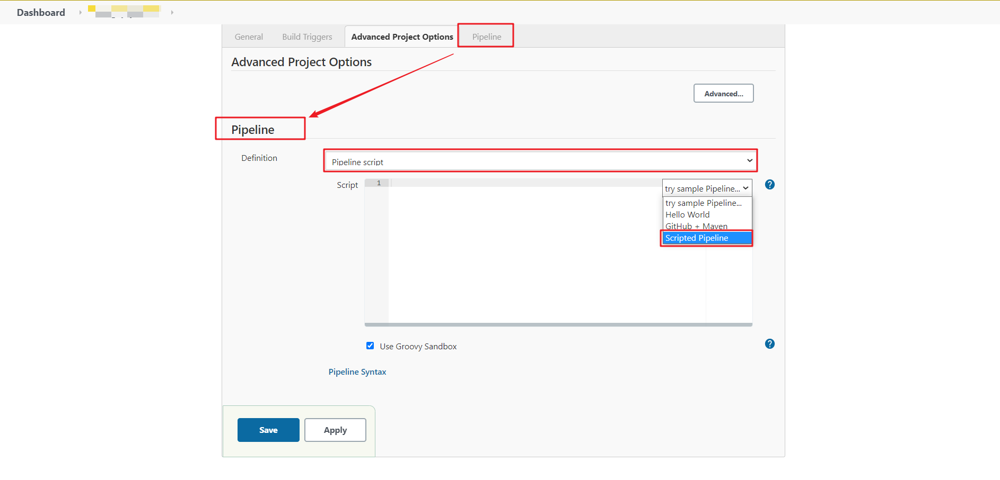
```groovy
node {
    def mvnHome
    stage('Preparation') { // for display purposes
    }

    stage('Build') {
    }

    stage('Results') {
    }
}
```
#### 3.4.1 脚本式语法节点说明
* Node：节点，一个 Node 就是一个 Jenkins 节点，Master 或者 Agent，是执行 Step 的具体运行环境，后续讲到Jenkins的Master-Slave架构的时候用到。
* Stage：阶段，一个 Pipeline 可以划分为若干个 Stage，每个 Stage 代表一组操作，比如：Build、Test、Deploy，Stage 是一个逻辑分组的概念。
* Step：步骤，Step 是最基本的操作单元，可以是打印一句话，也可以是构建一个 Docker 镜像，由各类 Jenkins 插件提供，比如命令：sh ‘make’，就相当于我们平时 shell 终端中执行 make 命令一样。

编写一个简单脚本式语法Scripted Pipeline：
```groovy
node {
    def mvnHome
    stage('拉取代码') { // for display purposes
        echo '拉取代码'
    }
    stage('编译构建') {
        echo '编译构建'
    }
    stage('项目部署') {
        echo '项目部署'
    }
}
```
效果图如下：


专家建议使用声明式脚本（try sample Pipeline），这样我们就不用再去学习Groovy语言了！！！

### 3.5 项目脚本样例如下：
>* 拉取代码
```groovy
pipeline {
    agent any
    stages {
        stage('拉取代码') {
            steps {
                checkout([$class: 'GitSCM', branches: [[name: '*/master']],
                doGenerateSubmoduleConfigurations: false, extensions: [], submoduleCfg: [],
                userRemoteConfigs: [[credentialsId: '68f2087f-a034-4d39-a9ff-1f776dd3dfa8', url:
                'git@192.168.66.100:itheima_group/web_demo.git']]])
            }
        }
    }
}
```
>* 编译打包
```groovy
pipeline {
    agent any
    stages {
        stage('拉取代码') {
            steps {
                checkout([$class: 'GitSCM', branches: [[name: '*/master']],
                doGenerateSubmoduleConfigurations: false, extensions: [], submoduleCfg: [],
                userRemoteConfigs: [[credentialsId: '68f2087f-a034-4d39-a9ff-1f776dd3dfa8', url:
                'git@192.168.66.100:itheima_group/web_demo.git']]])
            }
        }
        stage('编译构建') {
            steps {
                sh label: '', script: 'mvn clean package'
            }
        }
    }
}
```
>* 部署
```groovy
pipeline {
    agent any
    stages {
        stage('拉取代码') {
            steps {
                checkout([$class: 'GitSCM', branches: [[name: '*/master']],
                doGenerateSubmoduleConfigurations: false, extensions: [], submoduleCfg: [],
                userRemoteConfigs: [[credentialsId: '68f2087f-a034-4d39-a9ff-1f776dd3dfa8', url:
                'git@192.168.66.100:itheima_group/web_demo.git']]])
            }
        }
        stage('编译构建') {
            steps {
                sh label: '', script: 'mvn clean package'
            }
        }
        stage('项目部署') {
            steps {
                deploy adapters: [tomcat8(credentialsId: 'afc43e5e-4a4e-4de6-984fb1d5a254e434', path: '', url: 'http://192.168.66.102:8080')], contextPath: null,
                war: 'target/*.war'
            }
        }
    }
}
```

那这边学习完了上面的知识点是不是感觉流水线的工作方式要比正常的Jenkins任务简单的多呢！！!!其实还可以在优化一下，刚才我们都是直接在Jenkins的UI界面编写Pipeline代码，这样不方便脚本维护，建议把Pipeline脚本放在项目中（一起进行版本控制）

---
## 七、将Pipeline脚本进行版本控制
### 创建Jenkinsfile文件
在项目根目录建立`Jenkinsfile`文件，把脚本内容复制到该文件中，切记，`文件名一定是Jenkinsfile,不需要有任何扩展名`

Jenkinsfile也可以放在其他文件夹中，但是要在Pipeline Script from SCM中`明确Jenkinsfile文件的位置`
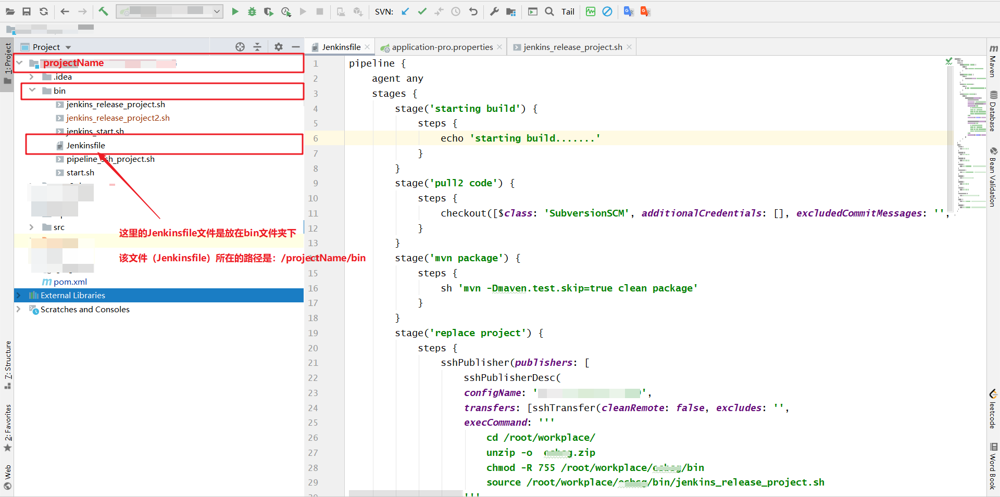
然后把该文件上传到SVN版本库中

在Jenkins引用该文件
由于该文件是在项目根目录下的bin文件夹下，所以Jenkinsfile文件路径类似于：
```
https://10.16.1.12:8089/svn/svnProjectName/trunk/base/projectName/bin
```
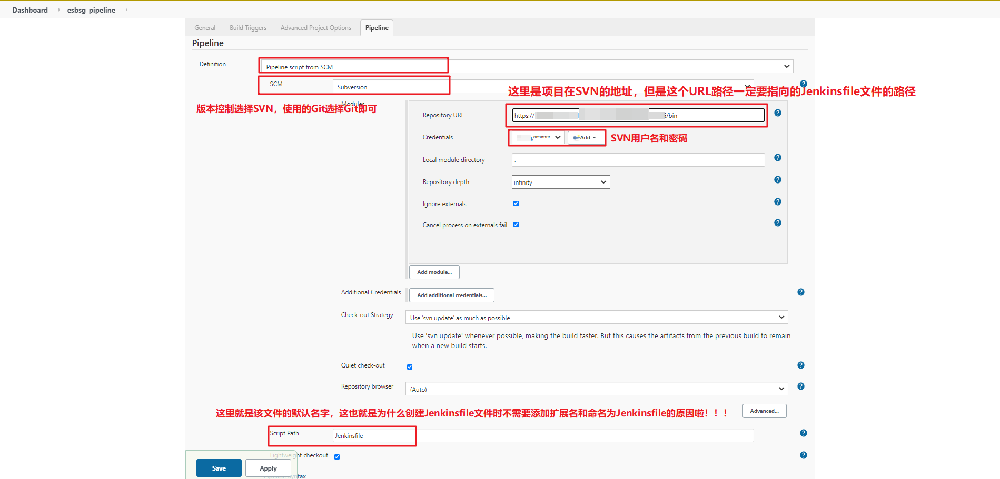

---
## 八、SSH远程部署
首先需要添加需要远程操作的Server服务器，操作如下：
> 选择系统管理（System Configuration） >> 系统设置（Configure System） >>  滑倒界面最下面找到（SSH Servers）

添加服务器操作位置如下：
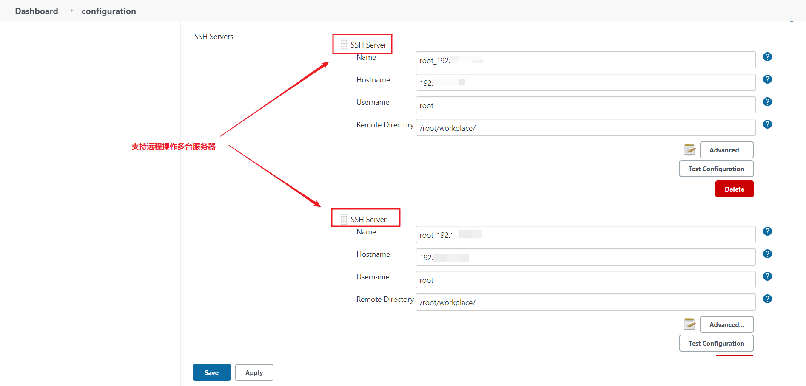
服务具体配置如下图所示：


上面配置好了之后，就可以通过流水线（pipeline）的脚本来实现远程部署任务！！！

---
## 九、Jenkinsfile文件脚本内容
```groovy
pipeline {
    agent any
    stages {
        stage('starting build') {
            steps {
                echo 'starting build.......'
            }
        }
        stage('pull2 code') {
            steps {
                checkout([$class: 'SubversionSCM', additionalCredentials: [], excludedCommitMessages: '', excludedRegions: '',  excludedRevprop: '', 
                    excludedUsers: '', filterChangelog: false,  ignoreDirPropChanges: false, includedRegions: '', 
                    locations: [[
                        cancelProcessOnExternalsFail: true,
                        credentialsId: '93482cf3-a060-4512-b7bd-86aab620606b', 
                        depthOption: 'infinity', 
                        ignoreExternalsOption: true, local: '.', remote: 'https://192.168.1.1:8441/svn/esbsg/trunk/base/SmartSG'
                    ]], 
                    quietOperation: true, workspaceUpdater: [$class: 'UpdateUpdater']
                ])
            }
        }
        stage('mvn package') {
            steps {
                sh 'mvn -Dmaven.test.skip=true clean package'
            }
        }
        stage('replace project') {
            steps {
                sshPublisher(publishers: [
                	sshPublisherDesc(
                	configName: 'root_12.15.1.1',
                	transfers: [sshTransfer(cleanRemote: false, excludes: '',
                        execCommand: '''
                            cd /root/workplace/
                            unzip -o  esbsg.zip
                            chmod -R 755 /root/workplace/esbsg/bin
                            source /root/workplace/esbsg/bin/jenkins_release_project.sh
                        ''',
                        execTimeout: 120000, flatten: false, makeEmptyDirs: false, noDefaultExcludes: false, patternSeparator: '[, ]+', 
                        remoteDirectory: '', remoteDirectorySDF: false, removePrefix: 'target/', sourceFiles: 'target/esbsg.zip')
                    ], 
                    usePromotionTimestamp: false, useWorkspaceInPromotion: false, verbose: false),

                	sshPublisherDesc(configName: 'root_12.15.1.1', 
                    transfers: [sshTransfer(cleanRemote: false, excludes: '',
                        execCommand: '''
                            cd /root/workplace/
                            unzip -o  esbsg.zip
                            chmod -R 755 /root/workplace/esbsg/bin
                            source /root/workplace/esbsg/bin/jenkins_release_project.sh
                        ''',
                        execTimeout: 120000, flatten: false, makeEmptyDirs: false, noDefaultExcludes: false, patternSeparator: '[, ]+',
                        remoteDirectory: '', remoteDirectorySDF: false, removePrefix: 'target/', sourceFiles: 'target/esbsg.zip')
                    ], 
                    usePromotionTimestamp: false, useWorkspaceInPromotion: false, verbose: false)
                ])
            }
        }
    }
    post {
      always {
        echo '构建状态:结束'
      }
      unstable {
        echo '构建状态:不稳定'
      }
      notBuilt {
        echo '构建状态:未构建'
      }
      cleanup {
        echo '构建状态:cleanup  注：如果无论构建状态如何，始终在所有其他条件下运行'
      }
      regression {
        echo '构建状态:regression  注：如果当前构建状态比以前的构建状态差，则运行'
      }
      aborted {
        echo '当构建状态为“已中止”时运行'
      }
      success {
        echo '构建状态:成功'
      }
      failure {
        echo '构建状态:失败'
      }
      unsuccessful {
        echo '当前构建状态为“已终止”，“失败”或“不稳定”'
      }
      fixed {
        echo '构建状态:fixed  注：先前的构建不成功并且当前的构建状态为“成功，则运行'
      }
      changed {
        echo '构建状态:fixed  注：如果当前构建状态与先前的构建状态不同，则运行'
      }
    }

}
```

其中远程操作的脚本主要是：
```groovy
sshPublisherDesc(
    configName: 'root_12.1.1.12',
    transfers: [
        sshTransfer(
            cleanRemote: false, 
            excludes: '',
            execCommand: '''
                cd /root/workplace/
                unzip -o  esbsg.zip
                chmod -R 755 /root/workplace/esbsg/bin
                source /root/workplace/esbsg/bin/jenkins_release_project.sh
            ''',
            execTimeout: 120000, 
            flatten: false, 
            makeEmptyDirs: false, 
            noDefaultExcludes: false, 
            patternSeparator: '[, ]+', 
            remoteDirectory: '', 
            remoteDirectorySDF: false, 
            removePrefix: 'target/', 
            sourceFiles: 'target/esbsg.zip'
        )
    ], 
    usePromotionTimestamp: false, 
    useWorkspaceInPromotion: false, 
    verbose: false
)
```

---
---
---
## 相关链接

* `项目在Github中查看`，点击Github连接；
* `项目下载到本地`，点击本地链接。

序号|Github链接|本地链接|README路径
:---|:---|:---|:---
1|[初识Jenkins](https://github.com/ZHoodLum/software-architect/blob/master/src/main/java/jenkins/JenkinsHelloWorldREADME.md)|[初识Jenkins](JenkinsHelloWorldREADME.md)|/src/main/java/jenkins/JenkinsHelloWorldREADME.md
2|[Jenkins环境安装](https://github.com/ZHoodLum/software-architect/blob/master/src/main/java/jenkins/JenkinsInstalREAMDE.md)|[Jenkins环境安装](JenkinsInstalREADME.md)|/src/main/java/jenkins/JenkinsInstalREAMDE.md
3|[Jenkins+SVN+Maven创建任务](https://github.com/ZHoodLum/software-architect/blob/master/src/main/java/jenkins/JenkinsSVNMavenREADME.md)|[Jenkins+SVN+Maven创建任务](JenkinsSVNMavenREADME.md)|/src/main/java/jenkins/JenkinsSVNMavenREADME.md
4|[`Jenkins+SVN+Maven+Pipeline创建任务`](https://github.com/ZHoodLum/software-architect/blob/master/src/main/java/jenkins/JenkinsSVNMavenPipelineREADME.md)|[Jenkins+SVN+Maven+Pipeline创建任务](JenkinsSVNMavenPipelineREADME.md)|/src/main/java/jenkins/JenkinsSVNMavenPipelineREADME.md
5|[Jenkins+Git+Maven+Pipeline创建任务](https://github.com/ZHoodLum/software-architect/blob/master/src/main/java/jenkins/JenkinsGitMavenREADME.md)|[Jenkins+Git+Maven+Pipeline创建任务](JenkinsGitMavenREADME.md)|/src/main/java/jenkins/JenkinsGitMavenREADME.md
6|[Jenkins细节优化](https://github.com/ZHoodLum/software-architect/blob/master/src/main/java/jenkins/JenkinsOptimizationREADME.md)|[Jenkins细节优化](JenkinsOptimizationREADME.md)|/src/main/java/jenkins/JenkinsOptimizationREADME.md

