# Jenkins+SVN+Maven创建任务

[TOC]

----
----
----

## 一、新建Maven任务
新建任务（new item） >> 输入任务名称（Enter an item name） >>  选择构建一个Maven项目 >> 点击确定按钮
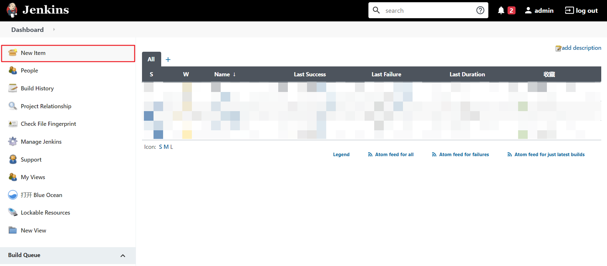
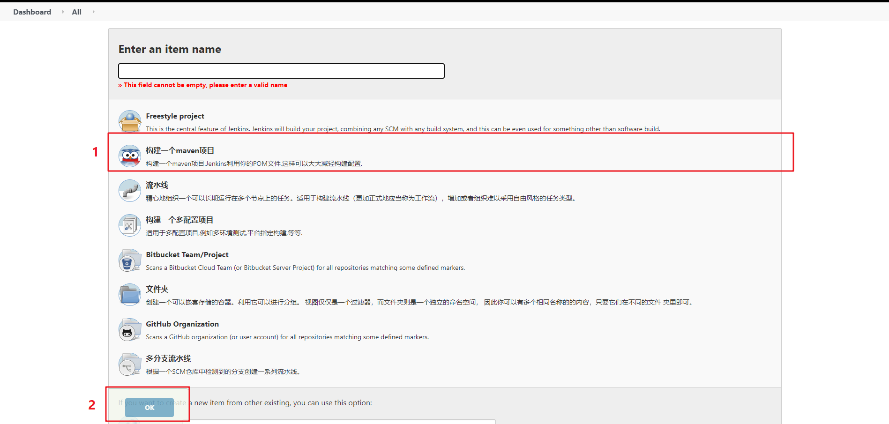
如果没有构建一个maven项目，那是因为没有安装maven插件，去插件管理中安装    Maven Integration

---
## 二、项目配置_General
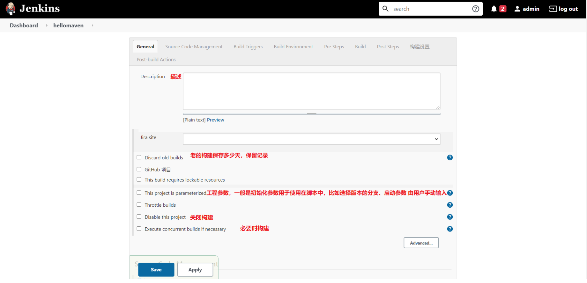

---
## 三、项目配置_源码管理_SourceCodeManagement
* 点击【Subversion】，如果没有，安装插件Subversion plugin即可！
* Repository URL：svn版本库地址，路径必须指定项目具体位置   
SVN的URL地址类似于：
```shell script
https://192.168.1.1:8441/svn/esbsg/trunk/base/SmartSG
```
* Credentials ：svn用户名/密码。如果没有添加就添加一个

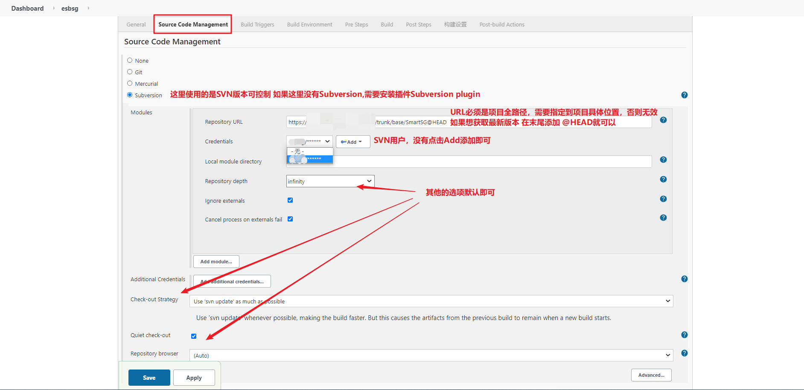
### 添加SVN用户_jenkins凭证提供者
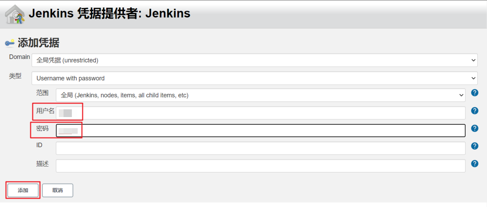

---
## 四、项目配置_构建触发器_BuildTriggers
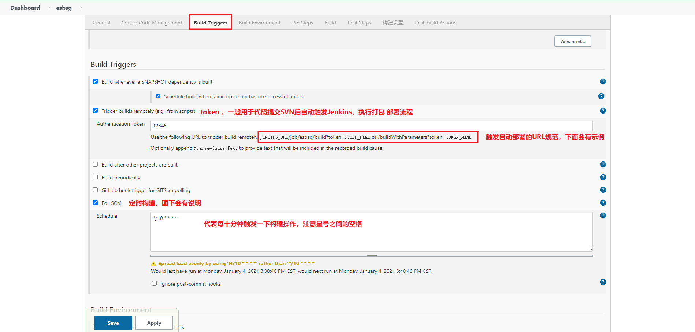

### 1. 自动触发Jenkins构建
检查是否可以构建，可以直接在浏览器中访问地址：
```shell script
http://11.18.1.12:8080/job/projectName/build?token=12345
```
#### 自动构建地址URL说明
成员|含义
:--- | :---
`http://11.18.1.12:8080`|访问jenkins的地址
`/job`|固定成员，可查看当前【任务配置】界面的URL的地址 `http://11.18.1.12:8080/job/projectName/configure`
`/projectName`|项目名称，也可查看任务配置界面的URL前一部分
`/build?token=`|固定成员，详情可查看图片中token下面的规则，有注释
`12345`|token值，这里为了测试输入的12345，此处的值也可以是加密的值

### 2. 定时构建
```shell script
*/10 * * * *

说明：每10分钟检查一次源码变化，如果有更新才build
```

#### 2.1 定时构建语法：* * * * * （五颗星，多个时间点，中间用逗号隔开）
任务含义|参数
:--- | :---
第一个表示分钟|取值0~59
第二个表示小时|取值0~23
第三个表示一个月的第几天|取值1~31
第四个表示第几月|取值1~12
第五个*表示一周中的第几天|取值0~7，其中0和7代表的都是周日
每5分钟构建一次|H/5 * * * *
每15分钟运行一次|H/15 * * * *
每30分钟构建一次|H/30 * * * *
每2小时构建一次|H H/2 * * *
每天早上8点构建一次|0 8 * * *
每天中午下班前定时构建一次|0 12 * * *
每天下午下班前定时构建一次|0 18 * * *
每天的8点，12点，22点，一天构建3次|0 8,12,22 * * *
一个小时的前30分钟，每10分钟运行一次 (30分钟, 可能在 4分，14分，24分)|H(0-29)/10 * * * *
每周一至周五，上午9:45到下午3:45，每隔2小时45分钟运行一次|45 9-15/2 * * 1-5
每两小时一次，每个工作日上午9点到下午5点(也许是上午10:38，下午12:38，下午2:38，下午4:38)|H H(9-17)/2 * * 1-5
除12月外，每月1号和15号每天一次|H H 1,15 1-11 *

### 3. Build periodically与Poll SCM区别
* Build periodically：任务周期性进行项目构建，这个是到指定的时间必须触发构建任务（无论SVN中数据有无变化，均执行定时化的构建）
* Poll SCM：
>* Poll SCM:定时检查源码变更（根据SCM软件的版本号），如果有更新就checkout最新code下来，然后执行构建动作（定时轮询SVN，查看SVN中是否有数据变化，如果有变化，则执行构建任务）
>* 如果我想每隔5分钟检查一次源码变化，SVN更新代码了才会执行Jenkins构建操作

---
## 五、项目配置_构建环境（Build Environment）
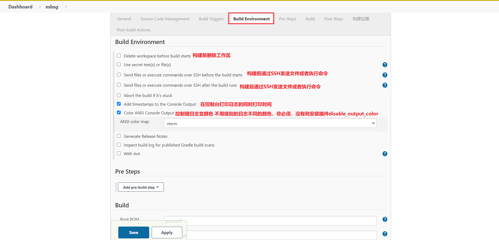

---
## 六、项目配置_Pre Steps(此处无需配置)

---
## 七、项目配置_构建（Build）
Golas and options 使用maven命令，根据实际情况决定
```shell script
clean install
或者
clean install -Dmaven.test.skip=true -Ptest
```
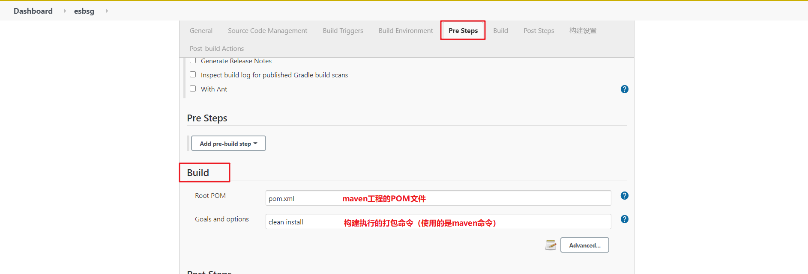

---
## 八、项目配置_构建后操作（Post Steps）
### 1. 构建后执行Shell脚本
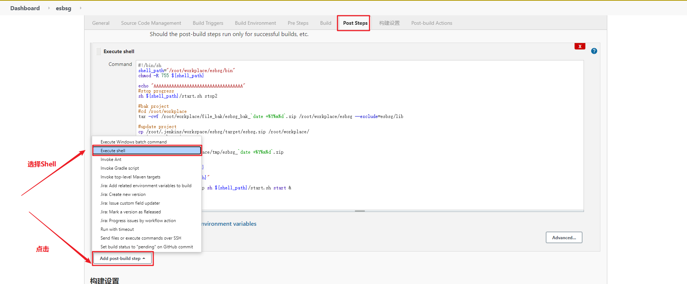
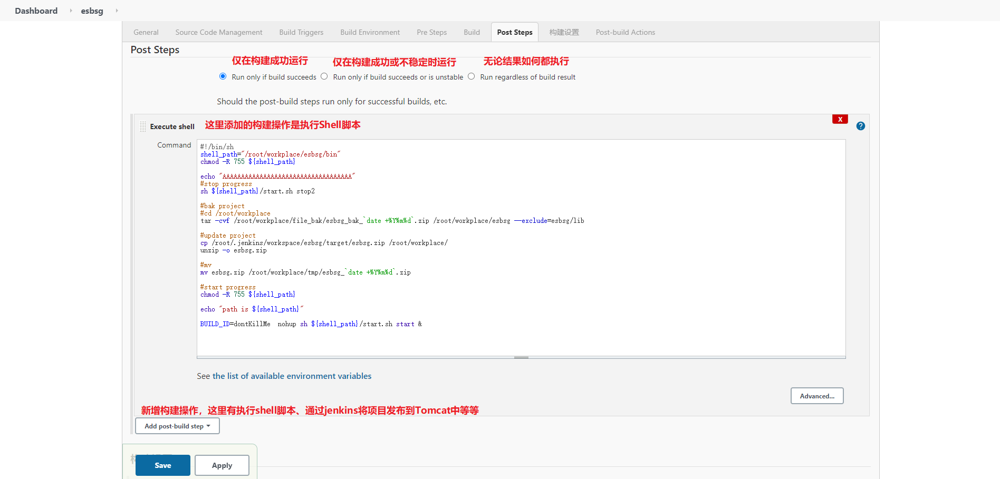

**以下脚本仅供参考！！！！**

#### 1.1 构建Shell脚本一如下：
```shell script
#!/bin/sh
init_shell="/root/workplace/springboot"
shell_path="/root/workplace/springboot/bin"

cd ${init_shell}

#是否为第一次部署项目
if [ $? -eq "0" ]; then
  	echo 'iterator commit......'
  	chmod -R 755 ${shell_path}

  	#stop progress
  	sh ${shell_path}/stop.sh

  	#bak project
  	cd /root/workplace/
  	mkdir version_bak
  	mkdir project_bak
	tar -cvf /root/workplace/version_bak/springboot_`date +%Y%m%d`.zip /root/workplace/springboot
	
    #update project
	cp /root/.jenkins/workspace/springboot_git_maven/target/springboot.zip /root/workplace

	unzip -o springboot.zip

	#mv version_bak
	mv springboot.zip /root/workplace/project_bak/springboot_$(date +%Y%m%d).zip

	#start progress
	chmod -R 755 ${shell_path}

	echo "path is ${shell_path}"

	BUILD_ID=dontKillMe  nohup sh ${shell_path}/start.sh &
else
	#update project
	cp /root/.jenkins/workspace/springboot_git_maven/target/springboot.zip /root/workplace/

	# 解压
	unzip -o springboot.zip

	#mv
	mv springboot.zip /root/workplace/project_bak/springboot_`date +%Y%m%d`.zip

	#start progress
    cd /root/workplace/springboot
	chmod -R 755 bin
	BUILD_ID=dontKillMe nohup ${shell_path}/start.sh &
fi
exit 0
echo "===========================end========================="

```

#### 1.2 构建Shell脚本二如下：
```shell script
#!/bin/sh
shell_path="/root/workplace/esbsg/bin"
chmod -R 755 ${shell_path}

#stop progress
sh ${shell_path}/start.sh stop2

#bak project
#cd /root/workplace
mkdir version_bak
mkdir project_bak
tar -cvf /root/workplace/version_bak/esbsg_bak_`date +%Y%m%d`.zip /root/workplace/esbsg --exclude=esbsg/lib

#update project
cp /root/.jenkins/workspace/esbsg/target/esbsg.zip /root/workplace/
unzip -o /root/workplace/esbsg.zip

#mv
mv /root/workplace/esbsg.zip /root/workplace/project_bak/esbsg_`date +%Y%m%d`.zip

#start progress
chmod -R 755 ${shell_path}

echo "path is ${shell_path}"

BUILD_ID=dontKillMe  nohup sh ${shell_path}/start.sh start &
```

### 2. 构建后通过SSH远程操作
正常来说Jenkins和要部署的代码都在一个服务上,可以不用配置远程操作
* name: 是Publish over SSH里面的名称
* Source files :要上传的文件,即压缩文件
* Remote directory : 指定上传的目录
* Exec command: 上传成功需要的操作
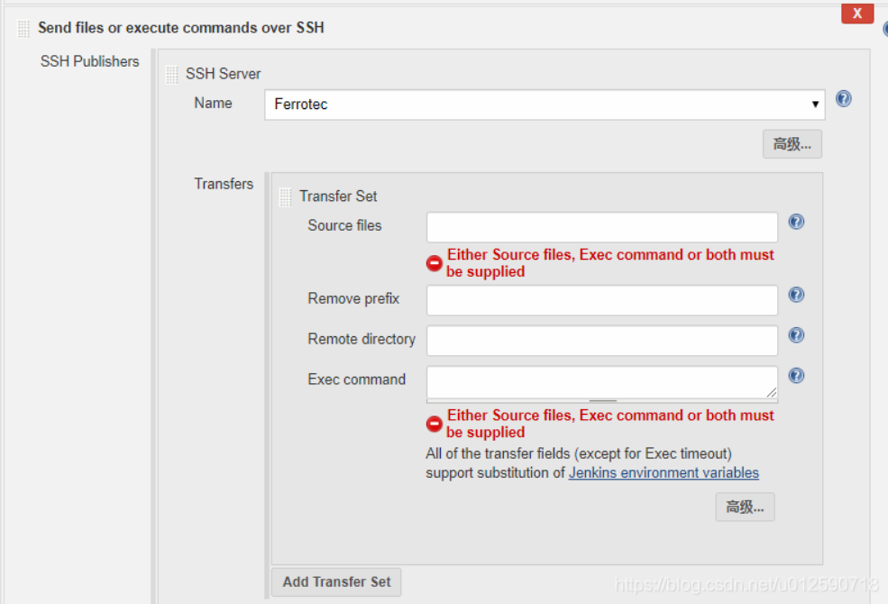
远程操作配置后续会在流水线任务中使用 [链接](JenkinsSVNMavenPipelineREADME.md)

---
## 九、项目配置_构建设置
（此处没有配置，自行选择）
### 通过邮件发送构建结果


---
## 十、项目配置_Post-build-Action
（此处没有配置，自行选择）
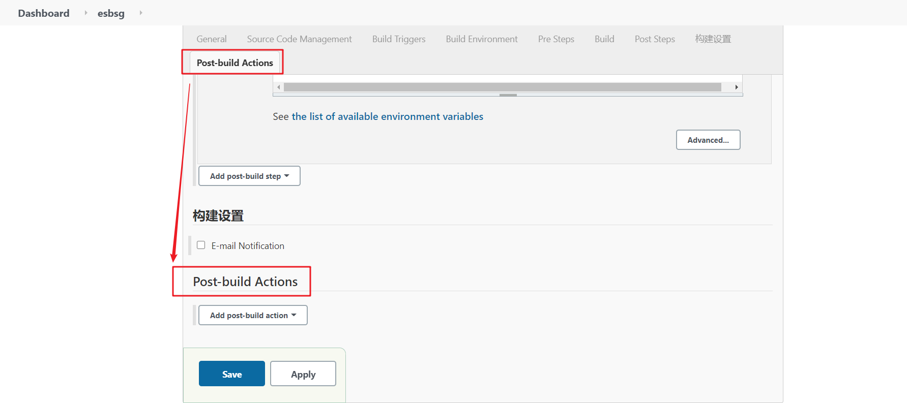

---
## 十一、保存并退出

---
## 十二、立即构建（build now）
保存构建配置后会返回到任务的根目录下，点击立即构建（build now）开始执行构建操作

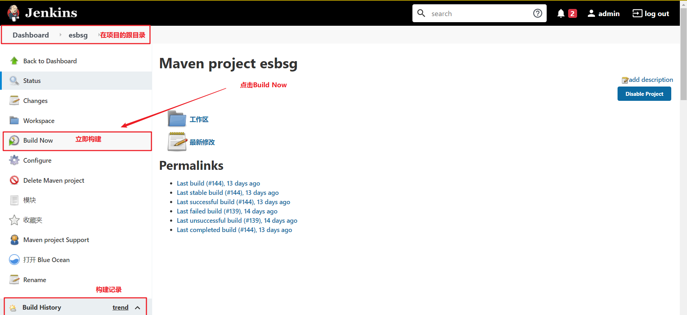

---
## 十三、查看构建日志（console output）
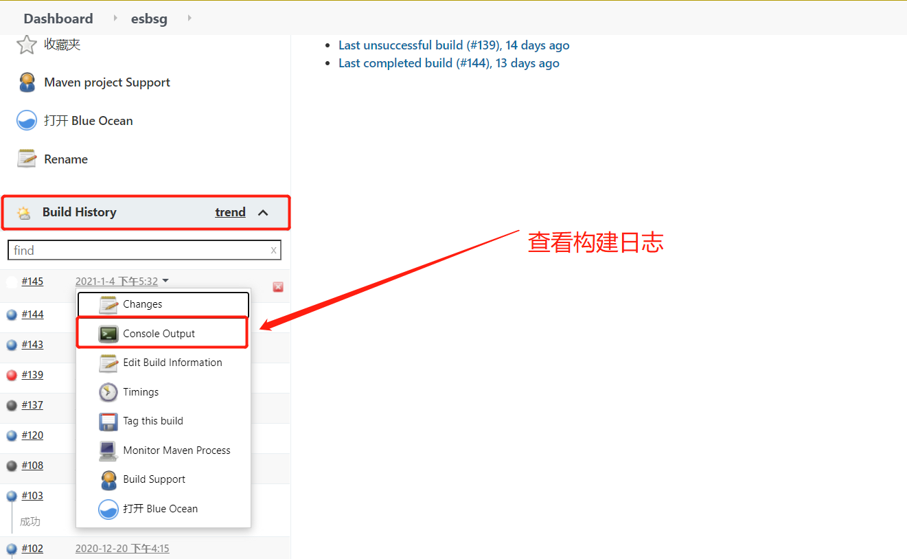

### 1. 日志解析如下：
提示：编译过程可能会报错，根据错误信息进行修改，然后再次build构建完成,有可能项目启动失败,查看log进行修改
### 1.1 从SVN拉去代码，Mavne打包阶段
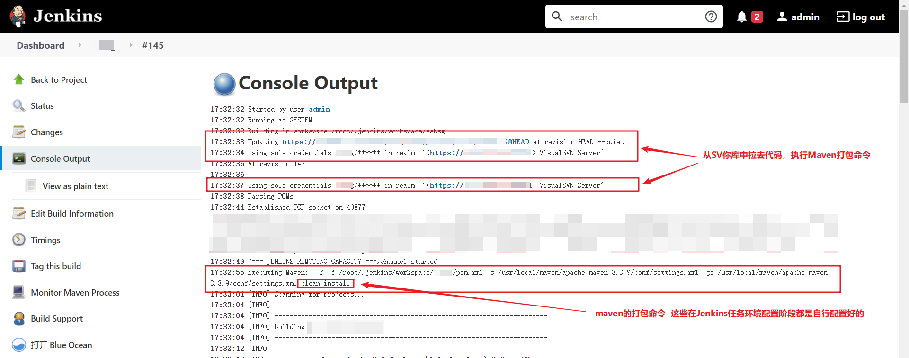
### 1.2 Maven打包后的状态

### 1.3 构建成功后的阶段
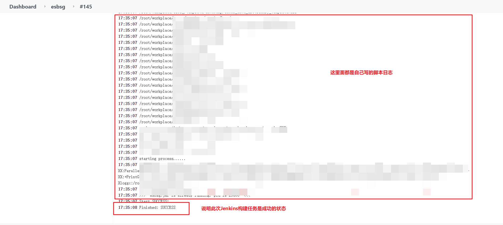


### 2. 说明 ：jenkins构建好的jar包在  /root/.jenkins/workspace/projectName/target/ 这个目录下 

---
---
---
## 相关链接

* `项目在Github中查看`，点击Github连接；
* `项目下载到本地`，点击本地链接。

序号|Github链接|本地链接|README路径
:---|:---|:---|:---
1|[初识Jenkins](https://github.com/ZHoodLum/software-architect/blob/master/src/main/java/jenkins/JenkinsHelloWorldREADME.md)|[初识Jenkins](JenkinsHelloWorldREADME.md)|/src/main/java/jenkins/JenkinsHelloWorldREADME.md
2|[Jenkins环境安装](https://github.com/ZHoodLum/software-architect/blob/master/src/main/java/jenkins/JenkinsInstalREAMDE.md)|[Jenkins环境安装](JenkinsInstalREADME.md)|/src/main/java/jenkins/JenkinsInstalREAMDE.md
3|[`Jenkins+SVN+Maven创建任务`](https://github.com/ZHoodLum/software-architect/blob/master/src/main/java/jenkins/JenkinsSVNMavenREADME.md)|[Jenkins+SVN+Maven创建任务](JenkinsSVNMavenREADME.md)|/src/main/java/jenkins/JenkinsSVNMavenREADME.md
4|[Jenkins+SVN+Maven+Pipeline创建任务](https://github.com/ZHoodLum/software-architect/blob/master/src/main/java/jenkins/JenkinsSVNMavenPipelineREADME.md)|[Jenkins+SVN+Maven+Pipeline创建任务](JenkinsSVNMavenPipelineREADME.md)|/src/main/java/jenkins/JenkinsSVNMavenPipelineREADME.md
5|[Jenkins+Git+Maven+Pipeline创建任务](https://github.com/ZHoodLum/software-architect/blob/master/src/main/java/jenkins/JenkinsGitMavenREADME.md)|[Jenkins+Git+Maven+Pipeline创建任务](JenkinsGitMavenREADME.md)|/src/main/java/jenkins/JenkinsGitMavenREADME.md
6|[Jenkins细节优化](https://github.com/ZHoodLum/software-architect/blob/master/src/main/java/jenkins/JenkinsOptimizationREADME.md)|[Jenkins细节优化](JenkinsOptimizationREADME.md)|/src/main/java/jenkins/JenkinsOptimizationREADME.md
