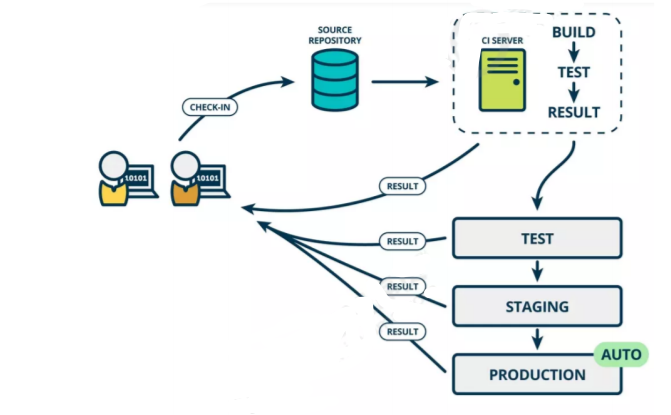

# 初识Jenkins
> 持续集成及Jenkins介绍

----
[TOC]

----
## 一、相关文档

文档|地址|备注
:----|:--------:|:----
Jenkins中文官方文档|[链接](https://www.jenkins.io/zh/doc/)|包括Jenkins入门、教程、用户手册、参考资料（流水线语法）
Jenkins官方地址|[链接](https://www.jenkins.io/)
自动化部署博客|[博主链接](https://www.cnblogs.com/momoyan/p/12775996.html#auto-id-3)|一个博主的链接，里面也有关于自动化部署的文章

---
## 二、软件开发生命周期
软件开发生命周期又叫做SDLC（Software Development Life Cycle），它是集合了计划、开发、测试
和部署过程的集合。如下图所示 ：

### 1. 需求分析
这是生命周期的第一阶段，根据项目需求，团队执行一个可行性计划的分析。项目需求可能是公司内部
或者客户提出的。这阶段主要是对信息的收集，也有可能是对现有项目的改善和重新做一个新的项目。
还要分析项目的预算多长，可以从哪方面受益及布局，这也是项目创建的目标。

### 2. 设计
第二阶段就是设计阶段，系统架构和满意状态（就是要做成什么样子，有什么功能），和创建一个项目
计划。计划可以使用图表，布局设计或者文者的方式呈现。

### 3. 实现
第三阶段就是实现阶段，项目经理创建和分配工作给开者，开发者根据任务和在设计阶段定义的目标进
行开发代码。依据项目的大小和复杂程度，可以需要数月或更长时间才能完成。

### 4. 测试
测试人员进行代码测试 ，包括功能测试、代码测试、压力测试等。

### 5. 进化
最后进阶段就是对产品不断的进化改进和维护阶段，根据用户的使用情况，可能需要对某功能进行修
改，bug修复，功能增加等。

---
## 三、软件开发瀑布模型
瀑布模型是最著名和最常使用的软件开发模型。瀑布模型就是一系列的软件开发过程。它是由制造业繁
衍出来的。一个高度化的结构流程在一个方向上流动，有点像生产线一样。在瀑布模型创建之初，没有
其它开发的模型，有很多东西全靠开发人员去猜测，去开发。这样的模型仅适用于那些简单的软件开
发， 但是已经不适合现在的开发了。

下图对软件开发模型的一个阐述。

需求分析 >> 系统设计 >> 实现 >> 测试 >> 部署 >> 系统维护

优势|劣势
:---|:---
简单易用和理解|各个阶段的划分完全固定，阶段之间产生大量的文档，极大地增加了工作量。
当前一阶段完成后，您只需要去关注后续阶段。|由于开发模型是线性的，用户只有等到整个过程的末期才能见到开发成果，从而增加了开发风险。
为项目提供了按阶段划分的检查节点|瀑布模型的突出缺点是不适应用户需求的变化。

---
## 四、软件的敏捷开发
### 1. 什么是敏捷开发？
敏捷开发（Agile Development） 的核心是`迭代开发（Iterative Development） `与 `增量开发（Incremental Development）`。

### 2. 何为迭代开发？
对于大型软件项目，传统的开发方式是采用一个大周期（比如一年）进行开发，整个过程就是一次"大开发"；
迭代开发的方式则不一样，它将开发过程拆分成`多个小周期`，即`一次大开发变成多次小开发`，
`每次小开发都是`同样的流程`，所以看上去就好像重复在做同样的步骤。

举例来说，SpaceX 公司想造一个大推力火箭，将人类送到火星。但是，它不是一开始就造大火箭，
而是先造一个最简陋的小火箭 Falcon 1。结果，第一次发射就爆炸了，直到第四次发射，才成功进入轨道。
然后，开发了中型火箭 Falcon 9，九年中发射了70次。最后，才开发 Falcon 重型火箭。
如果SpaceX 不采用迭代开发，它可能直到现在还无法上天。

### 3. 何为增量开发？
软件的每个版本，都会新增一个用户可以感知的完整功能。也就是说，`按照新增功能来划分迭代`。

举例来说，房产公司开发一个10栋楼的小区。如果采用增量开发的模式，
该公司第一个迭代就是交付一号楼，第二个迭代交付二号楼......每个迭代都是完成一栋完整的楼。
而不是第一个迭代挖好10栋楼的地基，第二个迭代建好每栋楼的骨架，第三个迭代架设屋顶......

### 4. 敏捷开发如何迭代？
虽然敏捷开发将软件开发分成多个迭代，但是也要求，每次迭代都是一个完整的软件开发周期，必须按
照软件工程的方法论，进行正规的流程管理。

### 5. 敏捷开发有什么好处?
* 早期交付
>敏捷开发的第一个好处，就是早期交付，从而大大降低成本。 还是以上一节的房产公司为例，如果按照
 传统的"瀑布开发模式"，先挖10栋楼的地基、再盖骨架、然后架设屋顶，每个阶段都等到前一个阶段完
 成后开始，可能需要两年才能一次性交付10栋楼。也就是说，如果不考虑预售，该项目必须等到两年后
 才能回款。 敏捷开发是六个月后交付一号楼，后面每两个月交付一栋楼。因此，半年就能回款10%，后
 面每个月都会有现金流，资金压力就大大减轻了。

* 降低风险
>敏捷开发的第二个好处是，及时了解市场需求，降低产品不适用的风险。 请想一想，哪一种情况损失比
 较小：10栋楼都造好以后，才发现卖不出去，还是造好第一栋楼，就发现卖不出去，从而改进或停建后
 面9栋楼？

---
---
## 五、什么是持续集成
持续集成（ Continuous integration ， 简称 CI ）指的是，频繁地（一天多次）将代码集成到主干。

`持续集成的目的，就是让产品可以快速迭代，同时还能保持高质量。`

它的核心措施是，代码集成到主干之前，必须通过自动化测试。只要有一个测试用例失败，就不能集成。
通过持续集成， 团队可以快速的从一个功能到另一个功能，简而言之，敏捷软件开发很大一部分都要归功于持续集成。

### 1.  持续集成的流程 

根据持续集成的设计，代码从提交到生产，整个过程有以下几步。

#### 1.1 提交
流程的第一步，是开发者向代码仓库提交代码。所有后面的步骤都始于本地代码的一次提交（commit）。

#### 1.2 测试（第一轮）
代码仓库对commit操作配置了钩子（hook），只要提交代码或者合并进主干，就会跑自动化测试。

#### 1.3 构建
通过第一轮测试，代码就可以合并进主干，就算可以交付了。

交付后，就先进行构建（build），再进入第二轮测试。所谓构建，指的是将源码转换为可以运行的实际代码，比如安装依赖，配置各种资源（样式表、JS脚本、图片）等等。

#### 1.4 测试（第二轮）
构建完成，就要进行第二轮测试。如果第一轮已经涵盖了所有测试内容，第二轮可以省略，当然，这时构建步骤也要移到第一轮测试前面。

#### 1.5 部署
过了第二轮测试，当前代码就是一个可以直接部署的版本（artifact）。将这个版本的所有文件打包（tar filename.tar * ）存档，发到生产服务器。

#### 1.6 回滚
一旦当前版本发生问题，就要回滚到上一个版本的构建结果。最简单的做法就是修改一下符号链接，指向上一个版本的目录

---
## 六、持续集成的组成要素
>* 一个自动构建过程， 从检出代码、 编译构建、 运行测试、 结果记录、 测试统计等都是自动完成的， 无需人工干预。
>* 一个代码存储库，即需要版本控制软件来保障代码的可维护性，同时作为构建过程的素材库，一般使用SVN或Git。
>* 一个持续集成服务器， Jenkins 就是一个配置简单和使用方便的持续集成服务器。

---
## 七、持续集成的好处
>* 降低风险，由于持续集成不断去构建，编译和测试，可以很早期发现问题，所以修复的代价就少；
>* 对系统健康持续检查，减少发布风险带来的问题；
>* 减少重复性工作；
>* 持续部署，提供可部署单元包；
>* 持续交付可供使用的版本；
>* 增强团队信心；

---
## 八、从装修厨房看项目开发效率优化（选择性观看）
### 1. 持续部署

#### 1.1 装修厨房
全部装好之后发现灯不亮，电路有问题；冷热水装反了，管路有问题。这些问题要解决就必须把地砖、墙砖拆掉——一个环节有问题，其他环节跟着返工。

那怎么做会好一些呢？任何安装完成及时测试，确保其可以正常工作。

#### 1.2 项目开发
开发过程中进行单元测试能够通过，但是部署到服务器上运行出现问题。

那怎么做会好一些呢？仅仅单元测试还不够，各个模块都必须能够在服务器上运行。

#### 1.3 关注点
持续部署的关注点在于项目功能部署至服务器后可以运行，为下一步测试环节或最终用户正式使用做好准备。

### 2. 持续集成
#### 2.1 装修厨房
装修厨房时我们需要铺地砖，如果把所有地砖都切好再拿去铺就会发现：每一块地砖单独看都是好的，但是实际铺的时候，把所有地砖整合起来，发现和厨房地面总体尺寸不匹配，边边角角的地砖需要重新切，时间和物料成本陡然升高。

那怎么做会好一些呢？切一块铺一块，根据需要的尺寸来切，尽早发现尺寸变化，避免返工。
#### 2.2 项目开发
各个小组分别负责各个具体模块开发，本模块独立测试虽然能够通过，但是上线前夕将所有模块整合到一起集成测试却发现很多问题，想要解决就需要把很多代码返工重写而且仍然有可能有问题，但现在时间很可能不够了。

那怎么做会好一些呢？经常性、频繁的把所有模块集成在一起进行测试，有问题尽早发现，这就是持
续集成。
#### 2.3 关注点
持续集成的关注点在于尽早发现项目整体运行问题，尽早解决。

### 3. 持续交付
#### 3.1 装修厨房
全部装修好之后房屋主人来验收，各项功能都正常，但是水龙头的样式主人不喜欢，灶台的位置主人不满意，要求返工。

那怎么做会好一些呢？房屋主人随时查看装修进度，施工团队及时调整。
#### 3.2 项目开发
项目的各个升级版本之间间隔时间太长，对用户反馈感知迟钝，无法精确改善用户体验，用户流失严重。

那怎么做会好一些呢？用小版本不断进行快速迭代，不断收集用户反馈信息，用最快的速度改进优化。
#### 3.3  关注点
持续交付的关注点在于研发团队的最新代码能够尽快让最终用户体验到。

### 4. 总体目标（好处）
#### 4.1 降低风险
一天中进行多次的集成，并做了相应的测试，这样有利于检查缺陷，了解软件的健康状况，减少假定。
#### 4.2 减少重复过程
产生重复过程有两个方面的原因，一个是编译、测试、打包、部署等等固定操作都必须要做，无法省略任何一个环节；另一个是一个缺陷如果没有及时发现，有可能导致后续代码的开发方向是错误的，要修复问题需要重新编写受影响的所有代码。而使用 Jenkins 等持续集成工具既可以把构建环节从手动完成转换为自动化完成，又可以通过增加集成频次尽早发现缺陷避免方向性错误。
#### 4.3 任何时间、任何地点生成可部署的软件
持续集成可以让您在任何时间发布可以部署的软件。从外界来看，这是持续集成最明显的好处，我们可以对改进软件品质和减少风险说起来滔滔不绝，但对于客户来说，可以部署的软件产品是最实际的资产。利用持续集成，您可以经常对源代码进行一些小改动，并将这些改动和其他的代码进行集成。如果出现问题，项目成员马上就会被通知到，问题会第一时间被修复。不采用持续集成的情况下，这些问题有可能到交付前的集成测试的时候才发现，有可能会导致延迟发布产品，而在急于修复这些缺陷的时候又有可能引入新的缺陷，最终可能导致项目失败。
#### 4.4 增强项目的可见性
持续集成让我们能够注意到趋势并进行有效的决策。如果没有真实或最新的数据提供支持，项目就会遇到麻烦，每个人都会提出他最好的猜测。通常，项目成员通过手工收集这些信息，增加了负担，也很耗时。持续集成可以带来两点积极效果：
>* 有效决策：持续集成系统为项目构建状态和品质指标提供了及时的信息，
有些持续集成系统可以报告功能完成度和缺陷率。
>* 注意到趋势：由于经常集成，我们可以看到一些趋势，如构建成功或失败、
总体品质以及其它的项目信息。
#### 4.5 建立团队对开发产品的信心
持续集成可以建立开发团队对开发产品的信心，因为他们清楚的知道每一次构建的结果，他们知道他们对软件的改动造成了哪些影响，结果怎么样。

----
## 九、持续集成工具（重点内容）
### 1. Jenkins 和 Hudson
目前最流行的一款持续集成及自动化部署工具。

`Jenkins` 和 `Hundson `之间的关系：2009 年，甲骨文收购了 Sun 并继承了 Hudson 代码库。在 2011 年年初，甲骨文和开源社区之间的关系破裂，该项目被分成两个独立的项目：
>* Jenkins：由大部分原始开发人员组成
>* Hudson：由甲骨文公司继续管理

所以 Jenkins 和 Hudson 是两款非常相似的产品。

### 2. 技术组合
>* Jenkins 可以整合 GitHub 或 Subversion
>* Husband 可以整合 GitHub 或 Subversion

二者既然是同源的工具软件，操作和指导思想就是接近的，所以本教程通过 Jenkins为大家呈现

---
## 十、Jenkins介绍

Jenkins 是一款流行的开源持续集成（Continuous Integration）工具，广泛用于项目开发，具有自动化构建、测试和部署等功能。官网： http://jenkins-ci.org/。

### 1. Jenkins的特征：
>* 开源的Java语言开发持续集成工具，支持持续集成，持续部署。
>* 易于安装部署配置：可通过yum安装,或下载war包以及通过docker容器等快速实现安装部署，可方便web界面配置管理。
>* 消息通知及测试报告：集成RSS/E-mail通过RSS发布构建结果或当构建完成时通过e-mail通知，生成JUnit/TestNG测试报告。
>* 分布式构建：支持Jenkins能够让多台计算机一起构建/测试。
>* 文件识别：Jenkins能够跟踪哪次构建生成哪些jar，哪次构建使用哪个版本的jar等。
>* 丰富的插件支持：支持扩展插件，你可以开发适合自己团队使用的工具，如git，svn，maven，docker等。

### 2. Jenkins安装和持续集成环境配置
持续集成流程说明

>* 首先，开发人员每天进行代码提交，提交到Git仓库
>* 然后，Jenkins作为持续集成工具，使用Git工具到Git仓库拉取代码到集成服务器，再配合JDK，
Maven等软件完成代码编译，代码测试与审查，测试，打包等工作，在这个过程中每一步出错，都重新
再执行一次整个流程。
>* 最后，Jenkins把生成的jar或war包分发到测试服务器或者生产服务器，测试人员或用户就可以访问
应用。

### 4. JavaEE项目部署方式对比
#### 4.1 手动部署

#### 4.1 自动化部署

`自动化`的具体体现：向版本库提交新的代码后，`应用服务器上自动部署`，用户或测试人员使用的马上就是`最新的应用程序`。

搭建上述持续集成环境可以把整个构建、部署过程自动化，很大程度上减轻工作量。对于程序员的日常开发来说不会造成任何额外负担——自己把代码提交上去之后，服务器上运行的马上就是最新版本——一切都发生在无形中。

下面我们讲带领大家一步一步搭建整套持续集成环境，这个操作过程只需要细心认真即可，没有任何难度。但是需要优秀的你具备以下前置知识：

>* Linux 基本操作命令和 VIM 编辑器使用
>* Maven 的项目构建管理
>* GitHub 或 SVN 使用

